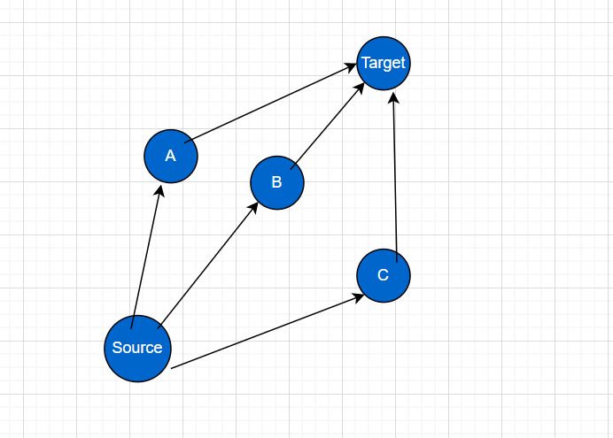
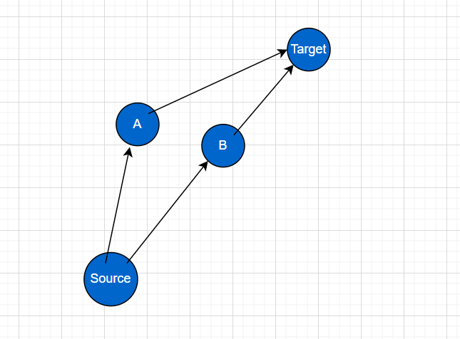
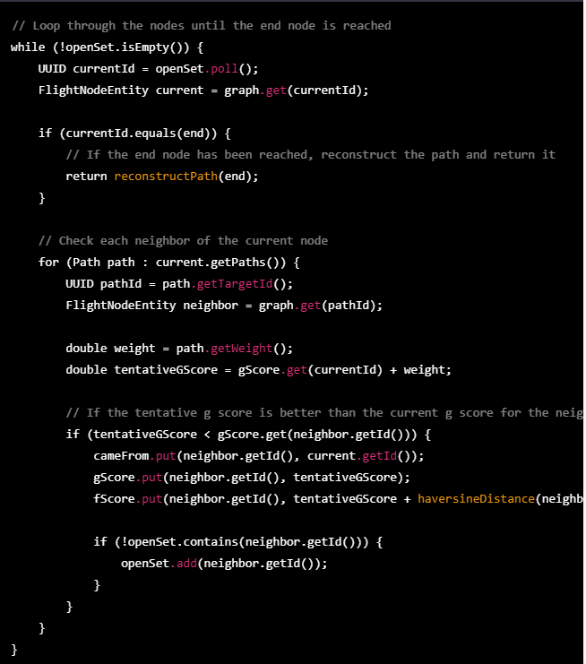
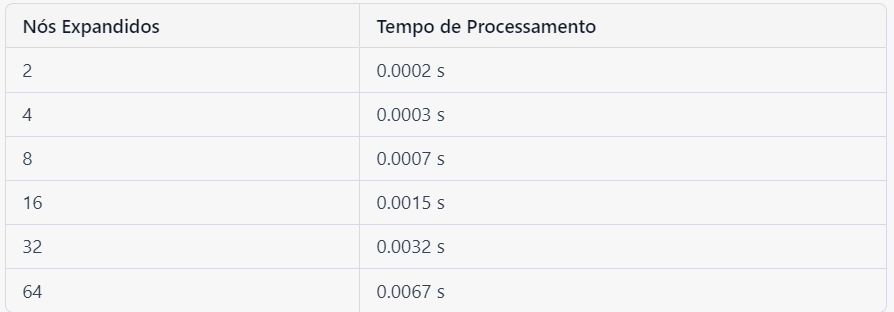
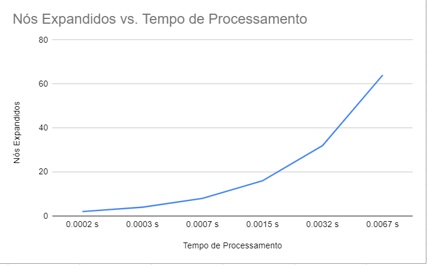

# Introdução
O meio militar envolve operações que visam o planejamento estratégico, a fim de definir uma direção ou caminho almejado pela corporação e que os gastos de recursos sejam minimizados e a eficiência do trabalho para alcançar o objetivo seja maximizada (Asplan, 2011). Para que esse planejamento estratégico consiga êxito no futuro, diversas empresas ou autarquias necessitam de tecnologias  que potencializam essa ideia de estratégia, além de desempenhar um papel na persecução dos objetivos organizacionais e garantir o alinhamento da empresa com esses mesmos objetivos (PETI, 2019). Dentro do planejamento estratégico existem diversas missões que necessitam das mais variadas logísticas e estratégias, entre elas existem missões aeroespaciais de reconhecimento, resgate e ataque em percursos próximos ao solo. Assim sendo, uma das ferramentas aeroespaciais militares utilizadas nesse contexto é o radar _Terrain-Following_, permitindo que o piloto, ao fazer o reconhecimento de uma região (muitas vezes desconhecida), voe em baixa altitude de modo constante, ou seja, sem variação da elevação da aeronave. A importância desse sistema se deve ao impedimento de uma possível detecção de um radar inimigo, além de facilitar o reconhecimento de um alvo ou até mesmo compreender a estrutura do relevo local.

Entretanto, a tecnologia _Terrain-following_ necessita de segurança e ponderações para a sua utilização durante as missões aéreas. O sistema se baseia na fusão de dados provenientes do mapeamento radar e de um banco de dados de terreno e obstáculos (Portal de Comunicações AEL, 2023). Assim sendo, é de suma importância que ocorra um reconhecimento prévio da região e a escolha de um melhor caminho possível. Todavia, a tecnologia _Terrain-following_ não supre essas necessidades de reconhecimento, gerando uma desvantagem inerente ao sistema. Portanto, o problema de pesquisa está relacionado à geração de trajetória, durante o evento do _Terrain-Following_, representada por grafos, no espaço bidimensional. Esses pontos representam uma região que a aeronave deve passar ou não e possui atributos geográficos reais que facilitam sua localização (latitude e longitude), além da visualização de rotas viáveis e inviáveis, a fim de fornecer uma orientação para o piloto durante a viagem. O cálculo desse percurso atribui ao desenvolvimento de um modelo matemático computacional que, através do conhecimento prévio da região (dados armazenados nesse banco), construa possíveis rotas que levem o avião de um ponto ao outro e especifique o caminho preferível para o seu deslocamento. Existem muitos trabalhos que abordaram o tema, principalmente relacionado às áreas de logística e transporte e utilizavam o conhecimentos de algoritmo de _Dijkstra_ e estrutura de dados para otimizar o transporte público de Criciúma/SC (A L Guizzo, C P Engelmann, J G Zannete, Simões P.W.T.A, G V SILVA, C V Scarpato, 2015). O nosso trabalho contém similaridades com o descrito anteriormente, contudo com ênfase na área de defesa, visto que a criação do algoritmo propicia que empresas e as forças armadas realizem o _Terrain-Following_, em conjunto com a tecnologia planejadora de voos, sem a preocupação de não percorrerem um trajeto viável. O resultado esperado é que o _software_ consiga destacar uma ou mais trajetórias viáveis através de dados de _input_ das cidades de saída e chegada feitas pelo usuário.

A gama de utilidades de voos de baixa altitude é bastante grande, abrangendo desde a aplicação de fertilizantes e defensivos agrícolas em grandes extensões de plantio até operações militares de busca, resgate, reconhecimento de terreno, dentre outras missões. Por sua vez, a operação desse tipo de voo apresenta riscos inerentes de colisão com o solo ou _CFIT_ do inglês _Controlled Flight Into Terrain_ (Da Costa, 2019). Atualmente, a empresa parceira do projeto, AEL Sistemas, provê sistemas de _Terrain-Following_, todavia o planejamento de uma possível rota é feito à mão. A elaboração dessa rota pode ser caracterizada como o problema do Caminho Mínimo da teoria de grafos, tendo como objetivo encontrar a rota com menor peso entre dois vértices (inicial e final) em um dado grafo _G_ com pesos. Para suprir a lacuna de planejamento de rotas de voos de baixa altitude não automatizado pela AEL e, consequentemente, diminuir os riscos de colisão com o solo, a presente pesquisa trouxe um sistema que automatiza todas essas funções, desde carregar um mapa suprido pelo banco de dados, gerar um grafo a partir de suas coordenadas geográficas, adicionar pesos às arestas e, por fim, apontar o melhor caminho mínimo para a missão.

A metodologia descrita neste trabalho científico é baseada na leitura de dados de imagem de arquivos _DTED_. Esses dados são transformados e processados utilizando estruturas de dados eficientes, algoritmos Java e métodos de controle de versão e de código, como o MVC (_Model_, _View_, _Control_) e o _Git WorkFlow_. O ambiente de desenvolvimento é contido em um _Docker_, juntamente com algumas dependências do _Maven_, como o _SPRINGBOOT_, que permite uma melhor manipulação do banco de dados _NoSQL Neo4j_ para armazenar as rotas calculadas pelo algoritmo $A*$(_A-star_). Este algoritmo, portanto, foi analisado dentre diversos outros, justamente para provar sua eficiência para o problema, e justificar sua escolha, além disso, foi provada sua corretude. Por fim, a solução exibe os resultados em um _front-end_ para visualização.

# Metodologia
Como mencionado anteriormente, o projeto envolve a compreensão de algoritmos e entender o funcionamento basilar de grafos e estrutura de dados, e como esses conceitos fundamentais em Ciência da Computação se relacionam com o projeto (Judith Gersting, 2017). Uma das estruturas de dados mais utilizadas para problemas de caminhos mínimos, a fila de prioridades (ou _heap_) que permite inserir elementos com uma determinada prioridade e remover o elemento de maior (ou menor) prioridade. Nos algoritmos de caminhos mínimos, a prioridade é determinada pela distância (ou custo) do caminho atual até o vértice adjacente(Carla Negri Lintzmayer e Guilherme Oliveira Mota, 2020).
Ademais, para que tal solução fosse viável, os principais materiais que foram utilizados para a construção do algoritmo de alta performance, capaz de identificar o melhor trajeto possível, são a linguagem de programação Java, necessária para a construção desses modelos computacionais, o banco de dados _NoSQL_, que contém as informações de relevo da região disponibilizadas pela empresa AEL. Desse modo, a linguagem java com o _framework Spring Boot Web_ como arquitetura MVC (_Model_, _View_, _Control_)  para a realização do CRUD (_Create_, _Read_, _Update_, _Delete_), necessário para manipular a estrutura do banco de dados orientado a grafos através de uma _API RESTful_. Além disso, esses dados estão na extensão de arquivo _DTED_ e por isso se faz necessário o uso da biblioteca _Geospatial Data Abstraction Library_ (_GDAL_), disponível na linguagem Java, capaz de extrair essas informações geográficas. De tal maneira, convertemos os dados do arquivo _DTED_ com essa biblioteca e posteriormente em objetos Java. Por outro lado, para o _NoSQL_, utilizamos outro banco de dados denominado _Neo4j_, orientado a grafos (manipulação dos dados através da linguagem _Cypher_), responsável pela modelagem matemática e a construção do raciocínio algorítmico dos fluxos. Por fim, para a visualização das rotas e a identificação do melhor caminho possível, utilizamos a biblioteca do _JavaScript_ chamada _D3js_. Desse modo, para que tais ferramentas fossem possíveis, todas essas tecnologias foram hospedadas através da aplicação _Docker_, que as isola em contêineres únicos, justamente para garantir a padronização do ambiente de desenvolvimento.

No entanto, é de suma importância a compreensão do funcionamento do algoritmo e que tipo de modelo foi desenvolvido para construção lógica do projeto planejador de voos. Assim sendo, utilizamos um algoritmo que é conhecido por muitos estudiosos na área da computação. Ele foi elaborado por Edsger Dijkstra, cientista da computação holandês, no final da década de 50 e até hoje é aplicado para propor rotas mais otimizadas. O algoritmo de _Dijkstra_ começa em um vértice de origem e visita todos os outros vértices do grafo para encontrar o caminho mais curto de origem para todos os outros vértices. Ele mantém uma lista de distâncias conhecidas a partir da origem para cada vértice do grafo, que são atualizadas à medida que o algoritmo avança. O algoritmo também mantém uma lista de vértices que ainda precisam ser visitados, e a cada iteração, escolhe o vértice com a menor distância conhecida para visitar em seguida.O algoritmo de _Dijkstra_ funciona apenas para arestas ponderadas não negativas e é implementado usando uma fila de prioridade para manter a lista de vértices a serem visitados, o que torna o algoritmo eficiente em termos de tempo. Ele é amplamente utilizado em aplicações práticas, como sistemas de roteamento em redes de computadores, sistemas de navegação em mapas e jogos de estratégia. Todavia, o algoritmo de _Dijkstra_ possui alguns problemas que no ponto de vista do projeto foram negativos pelo seu uso em específico. O funcionamento da aplicação são as requisições que o usuário faz no _front-end_ e essas mesmas requisições são passadas para o _SPRINGBOOT_ pelo protocolo _Rest_. Se é a primeira vez que a aplicação está sendo rodada, o usuário terá que popular no banco de dados com as informações do arquivo _DTED_. Para popular no banco de dados é utilizada a biblioteca _GDAL_ e a aplicação manda os dados manipulados para o _Neo4j_ que retorna um objeto _Json_ para a aplicação no _SPRINGBOOT_ que, por sua vez, envia para o _front-end_. Existiam muitos dados no arquivo e a representação das regiões por nós deste grafo eram muito pesadas e exigiam uma alta capacidade de processamento, assim sendo a preferência por um outro algoritmo que possua a mesma lógica do Dijkstra e resolvesse os problemas de consumo de tempo era considerável, portanto, o algoritmo escolhido foi o $A*$(_A-star_) com algumas determinações heurísticas.

De maneira mais precisa, nos baseamos no $H-A*$ ($Hierarchical A*$) que é uma variante do algoritmo $A*$ que usa uma estrutura de grafo hierárquico para melhorar o desempenho e a eficiência do $A*$. Esse algoritmo possui a capacidade de suprir as necessidades do algoritmo de _Dijkstra_. Dessa maneira, as principais vantagens do $A*$ sobre o _Dijkstra_  são eficiência, visto que pode ser mais rápido do que o algoritmo de _Dijkstra_ em grafos grandes. Isso ocorre porque o $H-A*$ usa uma estrutura de grafo hierárquico para reduzir o número de nós visitados. Isso pode levar a uma economia significativa de tempo em comparação com o algoritmo de _Dijkstra_, especialmente em grafos grandes e complexos. Também exige menos memória, pois o $H-A*$ usa uma estrutura de grafo hierárquico, ele pode ser mais eficiente em termos de uso de memória do que o algoritmo de _Dijkstra_. Isso ocorre porque o $H-A*$ armazena informações sobre subgrafos em vez de armazenar informações sobre cada nó individualmente. A terceira vantagem é a adaptabilidade do algoritmo, já que  O $H-A*$ é mais adaptável do que o algoritmo de _Dijkstra_. Isso ocorre porque o $H-A*$ pode ser facilmente ajustado para lidar com diferentes tipos de heurísticas, enquanto o algoritmo de _Dijkstra_ usa apenas uma medida de distância (peso da aresta). Por último existe a precisão do modelo, que geralmente é mais preciso do que o algoritmo de _Dijkstra_, pois usa uma heurística que leva em consideração informações adicionais sobre o grafo (Carla Negri Lintzmayer e Guilherme Oliveira Mota, 2020). A heurística usada pelo $H-A*$ pode ser personalizada para levar em conta fatores como a topologia do grafo, a localização do destino e a natureza das arestas.

# Análise da complexidade da solução proposta
A complexidade de um algoritmo é uma medida de quão "difícil" ou "custoso" ele é em termos de recursos computacionais, como tempo e espaço de memória. Em outras palavras, a complexidade de um algoritmo é uma medida da quantidade de recursos que ele precisa para resolver um determinado problema, e essa medida geralmente é expressa como uma função do tamanho da entrada do problema.

Existem diferentes tipos de complexidade, como a complexidade de tempo e a complexidade de espaço, que medem a quantidade de tempo ou espaço de memória necessária para executar o algoritmo. A complexidade de tempo é geralmente medida em termos do número de operações básicas executadas pelo algoritmo em relação ao tamanho da entrada do problema. Já a complexidade de espaço é medida em termos da quantidade de espaço de memória necessário para armazenar os dados usados pelo algoritmo em relação ao tamanho da entrada do problema.

A análise de complexidade é uma etapa importante na avaliação de algoritmos, pois permite comparar diferentes algoritmos para um mesmo problema e escolher o que é mais adequado para cada situação. Algoritmos com menor complexidade geralmente são mais eficientes em termos de tempo e espaço de memória, o que é especialmente importante em aplicações que lidam com grandes volumes de dados ou que exigem uma resposta rápida. O modelo utilizado para o desenvolvimento de nosso projeto é o algoritmo $A*$, que é utilizado para encontrar o caminho mais curto entre dois pontos em um grafo ponderado. Ele é uma extensão do algoritmo _Dijkstra_, com a adição de uma heurística que estima a distância restante para o destino.

Antes de explicar a análise da complexidade do algoritmo em si, precisamos entender o que leva o algoritmo $A*$ ter uma capacidade de processamento de memória mais rápido ou mais demorado, dependendo de algumas circunstâncias. O algoritmo utiliza uma estrutura de dados, que veremos posteriormente, chamada fila de prioridades. Essa estrutura de dados organiza seus elementos de acordo com uma determinada ordem de prioridade. Em uma fila de prioridades, os elementos com maior preferência são sempre os primeiros a serem processados (Stuart Jonathan Russel e Peter Norvig, 2010). A seguir, segue um passo a passo do funcionamento de uma fila de prioridades:
1. Inicialização: A fila de prioridades é criada e inicializada vazia.
2. Inserção: Quando um novo elemento é inserido na fila, ele é adicionado de acordo com sua prioridade. Os elementos com maior prioridade são colocados no topo da fila e os elementos com menor prioridade são colocados no final.
3. Remoção: Quando um elemento é removido da fila, o elemento com maior prioridade é sempre o primeiro a ser removido. Após a remoção, os elementos restantes são reorganizados para manter a ordem de prioridade.
4. Atualização: Em alguns casos, o valor de um elemento na fila de prioridades pode mudar. Quando isso acontece, a posição do elemento na fila também deve ser atualizada para manter a ordem de prioridade. Isso é feito removendo o elemento da fila e inserindo-o novamente com seu novo valor.
5. Consulta: É possível consultar o elemento de maior prioridade na fila sem removê-lo. Isso é útil quando se quer saber qual o próximo elemento que será processado.
6. Tamanho: É possível saber o tamanho atual da fila, ou seja, quantos elementos estão armazenados na fila.

Outro ponto importante a se comentar estão nas heurísticas, que são funções que ajudam a estimar a distância ou o custo de chegar de um determinado nó a um objetivo final em um grafo ou rede. As heurísticas são uma parte importante do algoritmo $A*$, pois ajudam a determinar a próxima etapa de busca a ser tomada, com base na distância ou no custo estimado de chegar ao objetivo.
No algoritmo $A*$, a heurística é usada para estimar o custo total de alcançar o objetivo a partir de um determinado nó. Isso é feito adicionando o custo real (calculado) de chegar ao nó atual com uma estimativa heurística do custo de chegar ao objetivo. O resultado é um valor que representa o custo total estimado de chegar ao objetivo a partir do nó atual (Stuart Jonathan Russel e Peter Norvig, 2010). A heurística usada no algoritmo $A*$ deve atender a dois requisitos:
1. A heurística deve ser admissível, o que significa que ela não pode superestimar o custo de chegar ao objetivo. Em outras palavras, a heurística deve sempre subestimar o custo total de chegar ao objetivo a partir do nó atual.
2. A heurística deve ser consistente, o que significa que o custo estimado de chegar a qualquer nó sucessor deve ser menor ou igual ao custo estimado de chegar ao nó atual mais o custo real de mover-se do nó atual para o sucessor.

A fórmula de Haversine é uma das principais heurísticas que utilizamos para calcular a distância geodésica entre dois pontos na superfície da Terra. Essa heurística é particularmente útil em aplicações que envolvem roteamento de veículos, como sistemas de navegação por GPS. O comportamento da heurística de Haversine no algoritmo $A*$ é semelhante a outras heurísticas usadas no algoritmo. A heurística de Haversine é usada para estimar o custo mínimo de movimento do nó atual ao objetivo final. Ela calcula a distância geodésica entre o nó atual e o objetivo final (Stuart Jonathan Russell e Peter Norvig, 2010). O nosso projeto envolve justamente a criação de melhores rotas para que o avião percorra uma determinada região com mais facilidade.

Continuando com a descrição de outro conceito primordial que envolve o funcionamento do algoritmo, temos o fator de ramificação. Ele é denominado pelo número médio de sucessores de cada nó em um grafo, além de ser um indicador da complexidade do próprio grafo, e pode influenciar o desempenho do algoritmo $A*$. Quanto maior o fator de ramificação, mais elemntos serão adicionados à fila de prioridades. Por isso, a escolha da heurística pode ser crucial para o desempenho do algoritmo em grafos com diferentes fatores de ramificação, visto que a heurística tem um peso maior (ela que determina o peso desse fator de ramificação). O fator de ramificação também pode afetar a capacidade de processamento e memória do algoritmo $A*$. Quanto maior o fator de ramificação, mais vértices o algoritmo precisa avaliar, o que aumenta o tempo de processamento e a quantidade de memória necessária para armazenar as informações da busca.
Além disso, o fator de ramificação também pode afetar a qualidade da solução encontrada pelo algoritmo. Quando o fator de ramificação é muito alto, pode ser difícil encontrar a solução ótima em um tempo razoável. Isso ocorre porque o algoritmo $A*$ pode ficar preso explorando caminhos que não levam a uma solução, o que é conhecido como "ramificação falsa". Quando o fator de ramificação é muito alto, muitos nós serão adicionados à fila de prioridade, aumentando seu tamanho e, consequentemente, o tempo de processamento do algoritmo. Além disso, quando muitos nós são adicionados à fila de prioridade, pode haver um aumento na possibilidade de que o algoritmo percorra caminhos desnecessários, o que também  leva a um aumento no tempo de execução e na utilização de memória (Stuart Jonathan Russel e Peter Norvig, 2010)

Segue um exemplo de duas imagens explicando como esses conceitos afetam o desempenho do algoritmo:

Nesse caso o Source é removido na fila de prioridades, porque já foi explorado, mas os elementos A, B e C são acrescentados na fila de prioridades. A prioridade de cada nó é calculada somando o custo do caminho já percorrido (**g(n)**) com uma estimativa do custo restante para atingir o objetivo (**h(n)**), ou seja, $f(n) = g(n) + h(n)$. O nó com menor valor de $f(n)$ é escolhido para ser explorado em seguida.

O _Source_ também é removido na fila de prioridades, porque já foi explorado, e os elementos A e B são acrescentados na fila de prioridades. (Grupo Maverick, 2023)

Além disso, outro fator importante para mensurar o trabalho e a leitura do algoritmo é o laço principal. Ele é a parte central do algoritmo que executa repetidamente um conjunto de instruções até que uma condição de término seja atingida. Esse laço é responsável por realizar a maior parte do processamento do algoritmo e é onde ocorre a maior utilização de recursos computacionais, como CPU e memória. O laço principal é tipicamente usado em algoritmos que precisam realizar uma determinada operação várias vezes ou que precisam processar grandes quantidades de dados. A sua implementação adequada é essencial para garantir que o algoritmo seja eficiente em termos de tempo de processamento e uso de memória. O laço principal (ou loop principal) do algoritmo $A*$ é o trecho de código que contém o laço "while" que é executado enquanto a lista de nós abertos não estiver vazia. Esse laço é responsável por iterar sobre os nós do grafo em busca do caminho mais curto entre o nó de origem e o nó de destino. A complexidade do algoritmo é afetada pelo número de nós no grafo, bem como pelo número de arestas que conectam esses nós. Como resultado, o tempo de processamento e memória aumenta à medida que o grafo cresce. O laço principal do algoritmo é executado até que o nó final seja alcançado. Em cada iteração, um nó é retirado da fila de prioridade "_openSet_" usando o método "_poll_". Em seguida, cada vizinho do nó atual é verificado para determinar o caminho mais curto para alcançá-lo. O número de vezes que o laço principal é executado depende do tamanho do grafo, da posição dos nós de origem e destino e do número de arestas que conectam esses nós. No geral, o desempenho do algoritmo depende da eficiência da heurística usada para calcular a distância estimada entre um nó e o destino final. Além disso, a implementação da fila de prioridade também pode afetar o desempenho do algoritmo.

Existe um caso no grafo em que se o algoritmo identificar o mwlhor caminho entre os pontos A e B e entre eles existem 62 nós. Não se pode afirmar com precisão quantas iterações exatas o algoritmo realiza. No entanto, podemos estimar a quantidade de vezes que o laço principal será executado. Uma forma de fazer isso é considerar o número médio de vizinhos de cada nó. Supondo que cada nó tem, em média, 4 vizinhos, temos:

1. Para o nó A, o algoritmo irá expandir 4 nós.
2. Para cada um dos 4 nós expandidos, o algoritmo irá expandir mais 4 nós, totalizando 16 nós expandidos.
3. Para cada um dos 16 nós expandidos, o algoritmo irá expandir mais 4 nós, totalizando 64 nós expandidos.
4. Esse processo continuará até que o nó B seja alcançado.

Portanto, podemos estimar que o laço principal será executado cerca de 64 vezes, considerando que a heurística de haversine é admissível e consistente.

Nesse trecho, o algoritmo percorre todos os nós do grafo até encontrar o nó final. Em cada iteração do loop, ele recupera o nó com a menor $f-score$ da fila de prioridade _openSet_. Em seguida, ele verifica todos os vizinhos desse nó e atualiza a $g-score$ e $f-score$ de cada vizinho se a nova pontuação for menor do que a pontuação atual. Se a pontuação for atualizada, o vizinho é adicionado à fila de prioridade. Esse loop é executado muitas vezes para encontrar a rota mais curta, e é por isso que ele consome a maior parte do tempo de processamento e memória.

A fim de comprovar a ideia que foi colocada, fizemos um teste empírico para entender o funcionamento da relação entre nós expandidos durante o processo de busca e o tempo de processamento de achar o caminho mais otimizado e também entender que Uma boa heurística é importante porque ajuda o algoritmo a tomar decisões mais informadas sobre quais caminhos seguir, permitindo que ele se aproxime do destino de maneira mais eficiente e com menos tentativas. Ao estimar com precisão o custo de chegar de um determinado nó ao destino, a heurística pode orientar o algoritmo em direção ao caminho mais promissor e, assim, reduzir o número de nós que precisam ser explorados, o que leva a economia de tempo de processamento e memória. Dessa forma, uma boa heurística pode ser essencial para resolver problemas mais complexos de maneira eficiente.

Note que a complexidade do algoritmo $A*$ é determinada pela quantidade de nós que ele precisa expandir para encontrar o caminho de menor custo. Essa quantidade de nós expandidos é influenciada pela profundidade do caminho de menor custo e pelo fator de ramificação do grafo de busca.O fator de ramificação do grafo de busca é definido como a média de filhos de cada nó no grafo. Se assumirmos que o fator de ramificação é constante, o algoritmo $A*$ pode ter sua complexidade analisada em termos da profundidade d do caminho de menor custo e do fator de ramificação $b$. Em um grafo com fator de ramificação $b$, o algoritmo $A*$ pode expandir até b nós em cada nível do grafo, em busca do caminho de menor custo. A profundidade do caminho de menor custo é d. Então, o número máximo de nós que podem ser expandidos pelo algoritmo $A*$ é dado por $b^d$. Assim, a complexidade assintótica do algoritmo $A*$ é $O(b^d)$, que representa a quantidade máxima de nós que podem ser expandidos durante a sua execução em um grafo com fator de ramificação $b$ e profundidade $d$.

A complexidade assintótica $O(b^d)$ é comumente associada a um crescimento exponencial em relação à profundidade da árvore de busca. Isso significa que, à medida que a profundidade da árvore aumenta, o número de nós explorados cresce exponencialmente em relação ao fator de ramificação b.Visualmente, isso se manifesta em uma curva de crescimento exponencial na quantidade de nós explorados em relação à profundidade da árvore de busca. Por exemplo, em um gráfico que apresenta a quantidade de nós explorados ao longo do tempo, a curva pode apresentar um aumento exponencial, à medida que a profundidade aumenta.Em termos de análise, isso significa que o tempo de execução do algoritmo $A*$ aumenta exponencialmente à medida que a profundidade da árvore aumenta, em uma taxa determinada pelo fator de ramificação $b$.

Diante dessas informações, O pior caso do algoritmo $A*$ ocorre quando todos os caminhos possíveis entre o nó inicial e o nó objetivo precisam ser considerados para encontrar o caminho ótimo. Em outras palavras, o algoritmo precisa percorrer todo o espaço de busca para encontrar a solução. A complexidade de tempo do algoritmo $A*$ é influenciada pelo fator de ramificação ($b$) e pela profundidade da solução ($d$). O fator de ramificação, como foi visto anteriormente, é definido como o número médio de sucessores que cada nó tem, enquanto a profundidade da solução é o número de nós que precisam ser visitados para alcançar a solução. O pior caso ocorre quando cada nó tem um grande número de sucessores, e a profundidade da solução é grande. Nesse cenário, a quantidade de nós que precisam ser visitados pelo algoritmo aumenta exponencialmente em relação ao fator de ramificação e à profundidade da solução. Por isso, o pior caso do algoritmo $A*$ é $O(b^d)$.

O melhor caso para o algoritmo $A*$ ocorre quando o nó de destino é o primeiro nó visitado pelo algoritmo. Nesse caso, o algoritmo encontra a solução sem precisar expandir nenhum outro nó, o que resulta em uma complexidade de tempo constante $\Omega(1)$ (representação do melhor caso através da letra grega _Omega_). Ou seja, há apenas um valor na entrada (Thomas H. Coemen, Charles E. Leiersson, Ronald L. Rivest e Clifford Stein, 2012).
No entanto, é importante destacar que esse é um caso muito específico e pouco comum na prática. Na maioria dos casos, o algoritmo $A*$ precisará expandir vários vértices antes de encontrar a solução. Além disso, a qualidade da heurística utilizada pode afetar significativamente o desempenho do algoritmo, mesmo nos melhores casos.

Observação: Os testes e a análise de dados que fizemos a fim de entender a relação do armazenamento dos dados com o tempo de processamento e memória dependem do tipo de dispositivo que foi utilizado durante o experimento em questão. Seguem as especificações do dispositivo em que foram realizados os testes empíricos:

**Nome do dispositivo**- Notebook-32.
**Processador**- 11th Gen Intel(R) Core(TM) i5-1145G7 @ 2.60GHz   1.50 GHz.
**RAM instalada**- 16,0 GB.
**Edição**- Windows 11 pro.
**Sistema**- Sistema operacional de 64 bits, processador baseado em x64.

# Análise de corretude do algoritmo
A corretude de um algoritmo é a garantia de que ele produz o resultado correto para todos os casos de entrada possíveis. Em outras palavras, um algoritmo é considerado correto se ele atende a sua especificação para todas as entradas possíveis. A análise da corretude do algoritmo é uma das principais preocupações dos cientistas da computação durante o processo de desenvolvimento de um algoritmo (THOMAS H. COEMEN, CHARLES E. LEISERSON, RONALD L. RIVEST e CLIFFORD STEIN, 2012).

A invariante do laço é uma técnica usada na análise da corretude do algoritmo, que consiste em encontrar uma propriedade que permanece verdadeira em todas as iterações do laço do algoritmo. A invariante do laço é uma expressão matemática que descreve a propriedade e é usada para demonstrar que o algoritmo atende a sua especificação. Essa técnica é amplamente utilizada na análise de algoritmos, especialmente em algoritmos iterativos, como ordenação, busca e muitos outros. Em nosso caso, como vimos anteriormente, aplicaremos essa técnica no algoritmo $A*$.

A invariante do laço do algoritmo $A*$ é a seguinte: a cada iteração, o nó com a menor estimativa de custo total ($f = g + h$) é escolhido para expansão.

Onde:

- $g$ = o custo do caminho percorrido do nó inicial ao nó atual;
- $h$ = heurística que estima o custo do caminho mais barato do nó atual ao nó objetivo;
- $f$ = soma de g e h, ou seja, a estimativa do custo total do caminho do nó inicial ao nó objetivo passando pelo nó atual.

O algoritmo $A*$ mantém uma lista de nós abertos e uma lista de nós fechados. A lista de nós abertos contém os nós que ainda não foram expandidos, enquanto a lista de nós fechados contém os nós que já foram expandidos. A invariante do laço garante que, a cada iteração, o nó com a menor estimativa de custo total na lista de nós abertos será escolhido para expansão, como já mencionado.

Essa invariante garante que, quando o nó objetivo é encontrado, a solução encontrada é ótima, ou seja, não há outro caminho mais curto. Além disso, a invariante garante que o algoritmo $A*$ é completo, ou seja, ele encontra uma solução se uma solução existe.

Para provar a invariante do laço, utilizaremos a técnica de indução.

## Primeiro elemento do conjunto
No início do algoritmo, o nó inicial é definido como nó atual e $g_{nó inicial} = 0$, pois o custo do caminho do nó inicial até ele mesmo é zero. Assim, temos que:

$f_{nó\hspace{1mm} inicial} = g_{nó\hspace{1mm} inicial} + h_{nó\hspace{1mm} inicial} = 0 + h_{nó\hspace{1mm} inicial} = h_{nó\hspace{1mm} inicial}$

Ou seja, $f_{nó\hspace{1mm} inicial}$ é igual à heurística do nó inicial.

## Hipótese
Suponha que a invariante $f = g + h$ seja verdadeira para todos os nós visitados pelo algoritmo até o momento.

## Indução
Vamos considerar $a$ o próximo nó a ser visitado pelo algoritmo, chamado de nó atual. Seja $p$ o nó predecessor do nó atual e $w_{p, a}$ o peso da aresta que liga $p$ a $a$.

Para esse novo nó atual, o algoritmo $A*$ calcula duas estimativas:

- $g_a$ = custo do caminho do nó inicial até o nó atual, passando por $p$
- $h_a$ = estimativa do custo do caminho do nó atual até o nó final.

Com base nisso, o algoritmo $A*$ atualiza o valor de $f_a$ como $f_a = g_a + h_a$ e verifica se o nó atual já foi visitado antes.

O algoritmo verifica se $a$ já foi visitado antes.
- Se $a$ já foi visitado antes, o algoritmo verifica se o novo caminho até ele é melhor que o anterior, comparando os valores de $g$ do caminho anterior e do novo caminho.
- Se o novo caminho for melhor, o algoritmo atualiza o nó com o novo valor de $g$ e o nó é adicionado novamente na lista de nós a serem visitados.

Analisando o passo da indução, podemos ver que a invariante $f = g + h$ continua sendo verdadeira para $a$. Isso ocorre porque o valor de $g_a$ é atualizado para o novo valor, mas a soma $f_a$ como $f_a = g_a + h_a$ continua sendo a mesma.

Assim, podemos concluir que a invariante $f = g + h$ é válida para todos os nós visitados pelo algoritmo $A*$, ou seja, a cada iteração do laço do algoritmo, a soma $f = g + h$ é mantida como invariante.

# Resultados obtidos
Primeiramente, o backend foi capaz de carregar os dados dos arquivos _DTED_ de forma eficiente, o que é fundamental para o sucesso da aplicação. O processo de carregamento dos dados é ativado através de uma requisição _POST_, o que permite que a solução seja facilmente integrada a outras aplicações que exigem a obtenção de rotas eficientes.

Em seguida, foi feita uma requisição _GET_, passando os parâmetros _sourceLat_, _sourceLon_, _targetLat_ e _targetLon_(que são respectivamente a latitude e longitude dos pontos de partida e chegada) para definir os nós de início e fim e rodá-los no algoritmo $A*$. O algoritmo calcula a distância real entre o _Source_ e o _Target_, atrevés da fórmula de Haversine (como vimos anterioremnte). A fórmula de Haversine é derivada da lei dos senos, que é uma relação matemática entre os lados e ângulos de um triângulo qualquer. No caso da Terra, os pontos de latitude e longitude formam um triângulo esférico cujos lados são arcos de círculos máximos. Para calcular a distância entre dois pontos nessa superfície esférica, precisamos usar uma variação da lei dos senos, conhecida como a lei dos haversines. A lei dos haversines nos permite encontrar o comprimento de um lado de um triângulo esférico em função dos lados e ângulos opostos. A partir da lei dos haversines, podemos chegar à fórmula de Haversine, que é uma maneira eficiente de calcular a distância entre dois pontos em uma esfera, como a Terra. Essa fórmula leva em consideração a curvatura da Terra e é baseada em trigonometria esférica, que é o ramo da matemática que lida com triângulos em esferas. Tendo a noção da distância entre o ponto de saída e chegada, o modelo tenta encontra a rota mais otimizada. Esse melhor trajeto aparece via _JSon_ no servidor. O caminho que aparece no servidor uma vez visto, ele é analisado no banco de dados Neo4J para provar a veracidade da informação. A maioria dos testes são satisfeitos e ele encontra de fato o trajeto através das propriedades dos pontos. Essas propriedades são representadas por três variáveis (latitude, longitude e altitude). Tanto a latitude como a longitude são representadas em radianos (pois na fórmula de Haversine precisa ser representada dessa maneira), e a elevação é dada em metros. 

Entretanto, não é possivel considerar apenas essas variáveis de maneira isolada. Na própria representação gráfica do banco de dados orientado à grafos precebe-se que além das três variáveis que existem nas propriedades de cada nó, existe outro fator necessário para a realização da leitura do algoritmo, o peso das arestas. Ele é calculado através da relação entre a latitude, longitude e altitude dos vértices. O peso _P_ das arestas é representado pela equação matemática _P=aE + bD_. As variáveis auxiliares a e b representa o peso interno que a altitude e a distância entre dois pontos adjacentes possuem. Nesse caso, considera-se _a_=2 e _b_=1, ou seja, o peso interno da variação de elevação _E_ é o dobro da distância _D_. Assim sendo, o algoritmo considera que a variação deve ser a menor possível comparada ao deslocamento que leva de um ponto ao outro. Todavia, existem casos em que o custo benefício de percorrer uma distância maior e uma variação de altitude menor produz um caminho mais otimizado do que o contrário. Por exemplo, ocorreu um teste em que o algoritmo tinha duas possibilidades de seguir sua trajetória. O primeiro caminho contava com uma variação de altitude de 2 metros e uma distância real de 20 metros, e desse modo, _P1_=24. A segunda opção de caminho possuía uma variação na elevação de 6 metros e uma distância real de 10 metros, sendo _P2_=22. Note que apesar de que a variação de elevação do segundo caso é muito alta comparada ao primeiro, entretanto ele possui uma distância menor e é muito mais plausível que o avião faça esse trajeto em vez do primeiro. Com o sistema de peso nas arestas relacionando as variáveis geográficas que existem na aplicação e no banco de dados tornou o algoritmo mais eficiente e mais próximo da realidade.

Após a execução do algoritmo, o caminho gerado foi salvo no banco de dados _Neo4j_ e retornado como resposta à requisição _GET_. Isso significa que a solução proposta é escalável e pode ser facilmente adaptada para trabalhar com diferentes tipos de terrenos. A requisição _GET_, com os parâmetros de entrada necessários, permite que a aplicação encontre a rota mais eficiente entre dois pontos, o que é útil em diversas aplicações que envolvem o planejamento de rotas, como entregas, transporte, entre outras. Assim sendo, resumindo de forma geral, os principais resultados obtidos foi que através do _input_ das coordenadas geográficas, o software consegue traçar a melhor rota de fato. Colocou-se na aplicação um simulador de voo e nelo é possível identificar que o avião consegue desviar de montanhas (regiões de elevada altitude), além de preferir o deslocameneto em rios e outras regiões de baixa altitude. Além disso, a solução proposta pode ser facilmente integrada a outros sistemas, tornando-se uma opção viável para a otimização de rotas em diversas áreas de atuação.

# Conclusão
A tecnologia apresentada nesta pesquisa possui grande relevância como solução para instituições de defesa do país, especialmente para operações militares de alta complexidade e sigilosidade. É válido ressaltar que essa solução proposta tem impactos diretos nos problemas iniciais enfrentados nessas operações, seja para reconhecimento, salvamento ou invasão de território inimigo. Essas operações são de alto risco e dependem de tecnologias que possam torná-las possíveis com a agilidade e execução requisitadas. Além disso, as soluções propostas até então são insuficientes, como é o caso da tecnologia _Terrain-Following_, que consiste em uma tecnologia de mapeamento 3D do terreno para a escolha do percurso com a menor altitude, de forma mais manual e sem análise do terreno como um todo, mas sim do local de sobrevoo da aeronave no momento em questão. Essa insuficiência torna difícil a previsibilidade de um caminho mínimo viável, o que foi solucionado com a tecnologia apresentada nesta pesquisa.

Logo, o impacto potencial da tecnologia desenvolvida, em alternativa e complemento da tecnologia _Terrain-Following_, é significativo. Esta solução possui alta tecnologia e complexidade de resolução, o que gera grande valor e interesse. Dessa forma, a resolução apresentada através do algoritmo $A*$ com a heurística proposta se torna uma solução viável de caminho mínimo entre o ponto de partida e destino apresentado pelo usuário para uso aeronáutico. Este algoritmo traz maior previsibilidade de um caminho viável, coisa que a tecnologia de _Terrain-Following_ não traz, completando-a. Muitas das imprevisibilidades do caminho e do terreno podem ser calculadas e descobertas por essa tecnologia. Em suma, as tecnologias, quando utilizadas em conjunto, são capazes de trazer mais confiabilidade e segurança na missão.

Para solucionar este problema, foi arquitetada uma solução composta por várias tecnologias harmoniosas que, em conjunto, oferecem uma solução eficiente no processamento e armazenamento dos dados de geografia necessários. Uma estrutura foi montada com o objetivo de padronizar este ambiente através do _Docker_, armazenando rotas em grafos pelo banco de dados _NoSQL Neo4j_, extração dos dados geográficos, manipulação dos mesmos através de tipos abstratos de dados e processamento de rotas por estes tipos abstratos através de algoritmos de caminho mínimo na linguagem _Java_. Por fim, os resultados foram processados e exibidos através de tecnologias de _front-end_ como _React Native_, _TypeScript_ e a biblioteca _D3_.

Dentre os resultados que foram levantados nesta pesquisa, é importante ressaltar a eficiência do backend da solução na leitura e armazenamento dos dados geográficos do _DTED_. Além disso, a _API_ de consumo e escrita dos dados foi pensada de forma eficiente para lidar com um grande número de dados. O processamento da rota pelo algoritmo $A*$ também trouxe excelentes resultados. Em especial, o uso desse algoritmo foi determinante para encontrar uma solução viável para o problema apresentado, levando em conta fatores como elevação, tipo de solo e outros elementos topográficos para encontrar a melhor rota possível entre os dois pontos definidos. O caminho retornado foi armazenado de maneira inteligente no banco _NoSQL Neo4j_, um banco orientado a grafos, especialmente porque o caminho é menor que todo o grafo processado e seu armazenamento se torna mais viável no banco. Por fim, a requisição _GET_ trabalhou para que o _front-end_ consuma os dados processados e exiba em uma tela de fácil visualização a rota gerada.

Em suma, a solução e pesquisa apresentadas neste artigo trazem uma grande contribuição para as ciências exatas. A solução agrega diversas tecnologias poderosas, tornando-a viável e comercializável para qualquer instituição interessada. No entanto, este é apenas um protótipo de solução e há espaço para melhorias significativas, incluindo uma análise mais aprofundada das estruturas de dados utilizadas e a incorporação de propriedades adicionais na heurística do algoritmo, bem como no armazenamento das rotas. É essencial que este trabalho seja utilizado como base para teste e comparação com outras soluções, para que possa ser referenciado e utilizado como um ponto de partida para novas alternativas.

# Referências Bibliográficas
AEL, Portal de comunicações. **Terrain Following**. Disponível em: <https://www.ael.com.br/terrain-following.html>. Acesso em: 20 fev. 2023.

ASPLAN. **Sistema de Planejamento Estratégico e Defesa**. Importância do Planejamento Estratégico,cap.3. Disponível em: <https://portal.tcu.gov.br/lumis/portal/file/fileDownload.jsp?fileId=8A8182A24F0A728E014F0AC5DCB653E4>. Acesso em: 20 fev. 2023

CORMEN, Thomas H.; LEISERSON, Charles E.; RIVEST, Ronald L.; STEIN, Clifford. **Algoritmos: Teoria e Prática**. 3. ed. Rio de Janeiro: Elsevier, 2012.

DA COSTA, Rodolfo Lobo. **Causa e prevenção de acidentes resultantes da colisão controlada com o solo – CFIT**. Universidade do Sul de Santa Catarina – UNISUL, Palhoça, SC. 2019.

ENGELMMAN, Christiane; G., Jackson **Utilização do Algoritmo de Dijkstra para Cálculo de Rotas no Trabalho Público do Município de Criciúma/SC**. Disponível em: <https://periodicos.unesc.net/ojs/index.php/sulcomp/article/download/1815/1717/5477>. Acesso em: 20 fev. 2023.

GERSTING, Judith L. **Fundamentos matemáticos para Ciência da Computação**. Rio de Janeiro: LTC – Livros Técnicos e Científicos Editora, 2017.

GRAMANI, Cristina M. **Abordagem de Caminho Mínimo para problemas de otimização**, XXXVI - SBPO, São João Del-Rei, MG. 23 a 26 de novembro de 2004.

LINTZMAYER, CN; OLIVEIRA MOTA, G. **Análise de Algoritmos e Estruturas de Dados**. Disponível em: <https://www.ime.usp.br/~mota/livros/livro_AAED.pdf>. Acesso em: 20 fev. 2023.

LUIZ, O. **PETI**. Intodução,cap.2. Disponível em: <https://www.gov.br/inpi/pt-br/acesso-a-informacao/tecnologia-da-informacao/arquivos/documentos/peti_20162019.pdf>. Acesso em: 20 fev. 2023.

PRESTES, E. **Introdução à Teoria dos Grafos**. Fundamentação Teórica,cap.1. Disponível em: <https://www.inf.ufrgs.br/~prestes/Courses/Graph%20Theory/Livro/LivroGrafos.pdf>. Acesso em: 20 fev. 2023.

RUSSELL, Stuart Jonathan; NORVIG, Peter. **Artificial Intelligence: A Modern Approach**. 3rd ed. Upper Saddle River, NJ: Prentice Hall, 2010.
