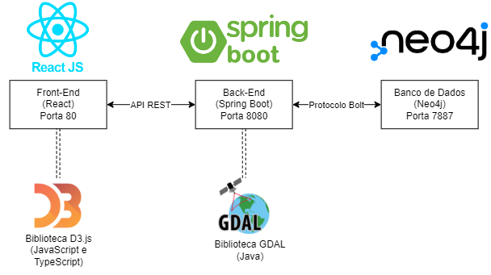

<table>
<tr>
<td>
<a href= "https://ael.com.br/"></a>
</td>
<td><a href= "https://www.inteli.edu.br/"></a>
</td>
</tr>
</table>

<font size="+12"><center>
Planejador de trajetórias para voos em baixa altitude
</center></font>

- [Autores](#autores)
- [Visão Geral do Projeto](#visão-geral-do-projeto)
  - [Empresa](#empresa)
  - [O Problema](#o-problema)
    - [Contexto do problema](#contexto-do-problema)
    - [Quais os dados disponíveis](#quais-os-dados-disponíveis)
    - [Qual o objetivo do problema](#qual-o-objetivo-do-problema)
    - [Qual a tomada de decisão do problema proposto](#qual-a-tomada-de-decisão-do-problema-proposto)
      - [Região de voo](#região-de-voo)
      - [Pontos de chegada e partida](#pontos-de-chegada-e-partida)
  - [Modelagem Matemática do Problema](#modelagem-matemática-do-problema)
    - [Variável de Decisão](#variável-de-decisão)
    - [Função objetivo](#função-objetivo)
    - [Limitações existentes no problema](#limitações-existentes-no-problema)
  - [Representação do Problema em um Grafo usando Neo4j](#representação-do-problema-em-um-grafo-usando-neo4j)
  - [Análise de complexidade do algoritmo](#análise-de-complexidade-do-algoritmo)
  - [Análise de corretude do algoritmo](#análise-de-corretude-do-algoritmo)
    - [Primeiro elemento do conjunto](#primeiro-elemento-do-conjunto)
    - [Hipótese](#hipótese)
    - [Indução](#indução)
  - [Descrição da solução](#descrição-da-solução)
    - [Problema](#problema)
    - [Qual a solução proposta](#qual-a-solução-proposta)
    - [Como a solução deverá ser utilizada](#como-a-solução-deverá-ser-utilizada)
    - [Benefícios trazidos pela solução](#benefícios-trazidos-pela-solução)
    - [Qual será o critério de sucesso e qual medida será utilizada para o avaliar](#qual-será-o-critério-de-sucesso-e-qual-medida-será-utilizada-para-o-avaliar)
  - [Objetivos](#objetivos)
    - [Objetivos gerais](#objetivos-gerais)
    - [Objetivos específicos](#objetivos-específicos)
  - [Partes interessadas](#partes-interessadas)
- [Análise do Problema](#análise-do-problema)
  - [Análise da área de atuação: Contexto da indústria](#análise-da-área-de-atuação-contexto-da-indústria)
    - [Principais competidores](#principais-competidores)
    - [Modelos de negócio](#modelos-de-negócio)
    - [Tendências de mercado](#tendências-de-mercado)
  - [Análise estratégica: 5 forças de Porter](#análise-estratégica-5-forças-de-porter)
  - [Análise do cenário: Matriz SWOT](#análise-do-cenário-matriz-swot)
  - [Proposta de Valor: Value Proposition Canvas](#proposta-de-valor-value-proposition-canvas)
  - [Matriz de Risco](#matriz-de-risco)
- [Requisitos do Sistema](#requisitos-do-sistema)
  - [Personas](#personas)
  - [Histórias dos usuários ("User Stories")](#histórias-dos-usuários-user-stories)
- [Arquitetura do Sistema](#arquitetura-do-sistema)
  - [Módulos do Sistema e Visão Geral (Big Picture)](#módulos-do-sistema-e-visão-geral-big-picture)
  - [Descrição dos Subsistemas](#descrição-dos-subsistemas)
    - [Requisitos de software](#requisitos-de-software)
  - [Tecnologias Utilizadas](#tecnologias-utilizadas)
    - [Docker](#docker)
    - [Ambiente de desenvolvimento](#ambiente-de-desenvolvimento)
    - [Front-end](#front-end)
    - [Back-end](#back-end)
- [UX e UI Design](#ux-e-ui-design)
  - [Wireframe + Storyboard](#wireframe--storyboard)
  - [Design de Interface - Guia de Estilos](#design-de-interface---guia-de-estilos)
- [Projeto de Banco de Dados](#projeto-de-banco-de-dados)
  - [Modelo Conceitual](#modelo-conceitual)
  - [Modelo Lógico](#modelo-lógico)
- [Teste de Software](#teste-de-software)
  - [Testes Unitários Automatizados (JUnit 5)](#testes-unitários-automatizados-junit-5)
  - [Testes de Integração da API Manuais](#testes-de-integração-da-api-manuais)
    - [Teste 1:](#teste-1)
    - [Teste 2:](#teste-2)
    - [Teste 3:](#teste-3)
    - [Teste 4:](#teste-4)
  - [Teste de Usabilidade](#teste-de-usabilidade)
- [Análise de Dados](#análise-de-dados)
- [Manuais](#manuais)
  - [Manual de Implantação](#manual-de-implantação)
  - [Manual do Usuário](#manual-do-usuário)
  - [Manual do Administrador](#manual-do-administrador)
- [Referências](#referências)


# Autores

* André Luís Lessa Junior
* Arthur Alberto Cardoso Reis
* Cristiane Andrade Coutinho
* Giovana Lisbôa Thomé
* João Pedro Sartori Garcia de Alcaraz
* Luiz Francisco Granville Gonçalves
* Stefano Tosi Butori


# Visão Geral do Projeto

## Empresa

AEL Sistemas é uma empresa do ramo de tecnologias militares e espaciais que foca em pesquisas e soluções com aplicações em plataformas terrestres, aéreas e marítmas. Desde 2001 faz parte do grupo internacional Elbit Systems, que lidera o segmento de defesa militar mundial. Com sua sede em Porto Alegre, Rio Grande do Sul, AEL produz sistemas que são reconhecidos e utilizados tanto nacional quanto internacionalmente.

## O Problema

### Contexto do problema

Diversas operações militares destinadas principalmente à defesa e segurança pública requerem voos de baixa altitude por questões de logística e detecção de aeronaves. Atualmente, a AEL Sistemas S.A. atende clientes com potencial de uso de sistemas capazes de traçar trajetórias desses tipos de voos, que apresentam altos riscos ligados às suas operações. O termo CFIT, do inglês Controlled Flight Into Terrain, refere-se à acidentes de colisão com solo em voos controlados, uma das principais causas de acidentes aéreos envolvendo mortes. Em decorrência da proximidade com o solo, o risco de CFIT aumenta consideravelmente.

### Quais os dados disponíveis

Inicialmente, a empresa parceira disponibilizou dados de duas regiões para testagem e desenvolvimento do sistema. São duas pastas com informações geográficas dos estados do Rio de Janeiro e São Paulo contidas em arquivos de extensão `.dt2`. Em seu carregamento, utilizando a biblioteca GDAL em Java, são visualizadas regiões com variações de cores dependendo de suas respectivas altitudes e coordenadas geográficas.

Esses dados, juntamente a outros, serão inputados pelo usuário no momento de utilização do sistema. Os seguintes inputs são planejados no escopo do projeto:

- Região de voo - como já mencionado, o sistema será alimentado com dados geográficos indicando a região que o voo acontecerá, incluindo latitude, longitude e altitude. O input será uma caixa de upload de arquivos tipo `.dt2`;
- Pontos de partida e chegada - serão vértices do grafo, representados por coordenadas geográficas. O input consiste em dados tipo `float` (como as coordenadas são no formato X.XXXXX) de latitude e longitude dentro da região de voo;

### Qual o objetivo do problema

A resolução do problema consiste em trazer um planejador de trajetórias para voos de baixa altitude utilizando grafos e o problema do caminho mínimo, a partir do mapeamento do terreno com base nos dados de relevo disponibilizados.

### Qual a tomada de decisão do problema proposto

Para desenvolvimento do projeto, é fundamental que todas as variáveis relacionadas ao problema, estejam tangiveis à solução.

Por isso, o grupo considera algumas variáveis para o desenvolvimento da solução que devem ser consideradas: região de voo, pontos de chegada e partida e zonas de exclusão.

#### Região de voo

Região que o voo será operado, incluindo variáveis de latitude, longitude e altitude da região.

#### Pontos de chegada e partida

Os vértices no grafo são representadas por coordenadas geográficas, em notação $x, y, z$.

Correspondem à latitude, longitude e altitude, na região de voo. Dessa forma, é considerado que para saber quais pontos (vertices ou nós) a rota obrigatoriamente deverá passar, é preciso que a rota percorra determinadas arestas (percurso do nó).

## Modelagem Matemática do Problema

Para representar o problema descrito previamente de uma forma matemática e computacionalmente eficiente, foi necessário a utilização de grafos. A area escolhida foi a região da USP, representado neste mapa: Aonde, os vértices escolhidos são pontos de referência e as arestas são as distâncias entre os pontos.


```
Partida - Share -> A
Destino - Inteli -> B
```

<br>

### Variável de Decisão

Para a tomada de decisão para o fluxo minimo, temos a seguinte variável: <br>
Sendo $x$ uma aresta do grafo entre o nó $i$ e o nó $j$, o peso da aresta será:

$x_{ij}$ = {<br>
  $\hspace{5mm}1$ se usar o caminho, <br>
  $\hspace{5mm}0$ se não usar <br>
}

Essa variável será aplicada conforme os pesos das arestas estabelecidos na função objetivo e as limitações existentes no problema, descritos a seguir.

<br>


### Função objetivo

A função objetivo considera as variáveis descritas previamente, na seção do problema, e atribui um peso para cada aresta.

$Min = 0,7x_{AR3} + 0,5x_{AR1} + 0,6x_{R1R3} + 0,5x_{R1R2} + 0,4x_{R2R3} + 0,8x_{R2R4} + 0,65x_{R3R4} + 0,5x_{R4R5} + 0,5x_{R4R13} + 0,8x_{R4R12} +0,5x_{R5R4} + 0,5x_{R13R4} + 0,8x_{R12R4} + 0,55x_{R5R6} + 1,2x_{R6R7}+ 0,9x_{R6R11} + 0,8x_{R6R12} + 0,6x_{R6R13} + 0,7x_{R7R8} + 1x_{R7R11} + 0,5x_{R7R10} + 1x_{R7R9} + 1x_{R7B} + 0,85x_{R8B} + 0,1x_{BR9} + 0,6x_{R9R10} + 0,4x_{R10R11} + 0,5x_{R11R12} + 0,8x_{R12R13} + 0,8x_{R12R4}$

<br>

### Limitações existentes no problema

$Nó\hspace {2mm} A: 1 = x_{AR3} + x_{AR1} \\
Nó\hspace {2mm} R3:x_{AR3} + x_{R1R3} + x_{R2R3} = x_{R3R4} \\
Nó\hspace {2mm} R1:x_{AR1} = x_{R1R2} + x_{R1R3} \\
Nó\hspace {2mm} R2: x_{R1R2} = x_{R2R3} + x_{R2R4} \\
Nó\hspace {2mm} R4: x_{R2R4} + x_{R3R4} + x_{R5R4} + x_{R13R4} + x_{R12R4} = x_{R4R5} + x_{R4R13} + x_{R4R12} \\
Nó\hspace {2mm} R5: x_{R4R5} = x_{R5R13} + x_{R5R6} \\
Nó\hspace {2mm} R6: x_{R5R6} = x_{R613} + x_{R6R12} + x_{R6R11} + x_{R6R7} \\
Nó\hspace {2mm} R7: x_{R6R7} = x_{R7R8} + x_{R7B} + x_{R7R9} + x_{R710} + x_{R7R11} \\
Nó\hspace {2mm} R8: x_{R7R8} = x_{R8B} \\
Nó\hspace {2mm} B: x_{R7RB} + x_{R8B} = 1 \\
Nó\hspace {2mm} R9: x_{BR9} + x_{R7R9} = x_{R9R10} \\
Nó\hspace {2mm} R10: x_{R710} + x_{R9R10} = x_{R10R11} \\
Nó\hspace {2mm} R11: x_{R6R11} + x_{R7R10} + x_{R10R11} = x_{R11R12} \\
Nó\hspace {2mm} R12: x_{R11R12} + x_{R6R12} + x_{R4R12} = x_{R12R4} + x_{R12R13} \\
Nó\hspace {2mm} R13: x_{R4R13} + x_{R5R13} + x_{R6R13} + x_{R12R13} = x_{R13R4} \\$

<br>

## Representação do Problema em um Grafo usando Neo4j

A representação do problema em um grafo pode ser realizada usando o banco de dados Neo4j, com o código abaixo:

```cypher
Create(v0:Share{nome:"Partida - Share",coord:"23°34'22.27'S 46°42'23.18'O"})
Create(v1:Share{nome:"Destino - Inteli",coord:"23°33'20.63'S  46°44'2.89'O"})
Create(v2:Region1{nome:"R1",coord:"23°34'18.82'S  46°42'30.63'O"})
Create(v3:Region2{nome:"R2",coord:"23°34'15.70'S  46°42'33.14'O"})
Create(v4:Region3{nome:"R3",coord:"23°34'4.30'S  46°42'28.85'O"})
Create(v5:Regio4{nome:"R4",coord:"23°33'53.99'S  46°42'47.05'O"})
Create(v6:Region5{nome:"R5",coord:"23°33'37.43'S  46°42'47.99'O"})
Create(v7:Region6{nome:"R6",coord:"23°33'26.03'S  46°43'9.04'O"})
Create(v8:Region7{nome:"R7",coord:"23°33'13.73'S  46°43'34.00'O"})
Create(v9:Region8{nome:"R8",coord:"23°33'3.06'S  46°43'55.06'O"})
Create(v10:Region9{nome:"R9",coord:"23°33'26.10'S  46°44'0.73'O"})
Create(v11:Region10{nome:"R10",coord:"23°33'34.72'S  46°43'42.55'O"})
Create(v12:Region11{nome:"R11",coord:"23°33'39.21'S  46°43'33.42'O"})
Create(v13:Region12{nome:"R12",coord:"23°33'48.22'S  46°43'16.29'O"})
Create(v14:Region13{nome:"R13",coord:"23°33'43.83'S  46°43'7.46'O"})
Create(v0)-[a1:var_1{distancia:"0,5"}]->(v2)
Create(v0)-[a2:var_2{distancia:"0,7"}]->(v4)
Create(v2)-[a3:var_3{distancia:"0,5"}]->(v3)
Create(v2)-[a4:var_4{distancia:"0,6"}]->(v4)
Create(v3)-[a5:var_5{distancia:"0,4"}]->(v4)
Create(v3)-[a6:var_6{distancia:"0,8"}]->(v5)
Create(v4)-[a7:var_7{distancia:"0,65"}]->(v5)
Create(v5)-[a8:var_8{distancia:"0,5"}]->(v6)
Create(v5)-[a9:var_9{distancia:"0,6"}]->(v14)
Create(v5)-[a10:var_10{distancia:"0,8"}]->(v13)
Create(v6)-[a11:var_11{distancia:"0,55"}]->(v7)
Create(v6)-[a12:var_12{distancia:"0,6"}]->(v14)
Create(v7)-[a13:var_13{distancia:"1,2"}]->(v8)
Create(v7)-[a14:var_14{distancia:"0,6"}]->(v14)
Create(v7)-[a15:var_15{distancia:"0,8"}]->(v13)
Create(v7)-[a16:var_16{distancia:"0,9"}]->(v12)
Create(v8)-[a17:var_17{distancia:"0,7"}]->(v9)
Create(v8)-[a18:var_18{distancia:"1"}]->(v10)
Create(v8)-[a19:var_19{distancia:"0,5"}]->(v11)
Create(v8)-[a20:var_20{distancia:"1"}]->(v12)
Create(v8)-[a21:var_21{distancia:"1"}]->(v1)
Create(v9)-[a22:var_22{distancia:"0,85"}]->(v1)
Create(v1)-[a23:var_23{distancia:"0,1"}]->(v10)
Create(v10)-[a24:var_24{distancia:"0,6"}]->(v11)
Create(v11)-[a25:var_25{distancia:"0,4"}]->(v12)
Create(v12)-[a26:var_26{distancia:"0,5"}]->(v13)
Create(v13)-[a27:var_27{distancia:"0,8"}]->(v14)
Create(v6)-[a28:var_28{distancia:"0,5"}]->(v5)
Create(v14)-[a29:var_29{distancia:"0,6"}]->(v5)
Create(v13)-[a30:var_30{distancia:"0,8"}]->(v5)

Return v0,v1,v2,v3,v4,v5,v6,v7,v8,v9,v10,v11,v12,v13,v14,a2,a1,a3,a4, a5,a6,a7,a8,a9,a10,a11,a12,a13,a14,a15,a16,a17,a18,a19,a20,a21,a22,a23,a24,a25,a26,a27,a28,a29,a30
```

O código acima irá gerar um grafo, que pode ser representado visualmente da seguinte forma:


Nesse caso, o ponto de partida seria  o ponto "Partida (Share)" e o de destino "Destino (Inteli)".

Outra maneira de representar o grafo é com a seguinte matriz de adjacência:


Utilizando o grafo formado, um exemplo de caminho é o problema do caminho mínimo, procurando a menor distância possível:

$Partida (Share), R1, R2, R3, R4, R13, R12, R11, R10, R9,Destino(Inteli)$ com uma distância de $5,05km$.

Outro caminho possível, inciando no vértice de partida (Share) e terminando no vértice de chegada (Inteli), porém sem utilizar peso mínimo como critério:

$Partida (Share), R3, R4, R5, R6, R7, R8, Destino (Inteli)$ com uma distância de $5,15km$.

## Análise de complexidade do algoritmo
A complexidade de um algoritmo é uma medida de quão "difícil" ou "custoso" ele é em termos de recursos computacionais, como tempo e espaço de memória. Em outras palavras, a complexidade de um algoritmo é uma medida da quantidade de recursos que ele precisa para resolver um determinado problema, e essa medida geralmente é expressa como uma função do tamanho da entrada do problema.

Existem diferentes tipos de complexidade, como a complexidade de tempo e a complexidade de espaço, que medem a quantidade de tempo ou espaço de memória necessária para executar o algoritmo. A complexidade de tempo é geralmente medida em termos do número de operações básicas executadas pelo algoritmo em relação ao tamanho da entrada do problema. Já a complexidade de espaço é medida em termos da quantidade de espaço de memória necessário para armazenar os dados usados pelo algoritmo em relação ao tamanho da entrada do problema.

A análise de complexidade é uma etapa importante na avaliação de algoritmos, pois permite comparar diferentes algoritmos para um mesmo problema e escolher o que é mais adequado para cada situação. Algoritmos com menor complexidade geralmente são mais eficientes em termos de tempo e espaço de memória, o que é especialmente importante em aplicações que lidam com grandes volumes de dados ou que exigem uma resposta rápida. O modelo utilizado para o desenvolvimento de nosso projeto é o algoritmo _A*_, que é utilizado para encontrar o caminho mais curto entre dois pontos em um grafo ponderado. Ele é uma extensão do algoritmo _Dijkstra_, com a adição de uma heurística que estima a distância restante para o destino.

Antes de explicar a análise da complexidade do algoritmo em si, precisamos entender o que leva o algoritmo _A*_ ter uma capacidade de processamento de memória mais rápido ou mais demorado, dependendo de algumas circunstâncias. O algoritmo utiliza uma estrutura de dados, que veremos posteriormente, chamada fila de prioridades. Essa estrutura de dados organiza seus elementos de acordo com uma determinada ordem de prioridade. Em uma fila de prioridades, os elementos com maior preferência são sempre os primeiros a serem processados (STUART JONATHAN RUSSEL e PETER NORVIG, 2010). A seguir, segue um passo a passo do funcionamento de uma fila de prioridades:
1. Inicialização: A fila de prioridades é criada e inicializada vazia.
2. Inserção: Quando um novo elemento é inserido na fila, ele é adicionado de acordo com sua prioridade. Os elementos com maior prioridade são colocados no topo da fila e os elementos com menor prioridade são colocados no final.
3. Remoção: Quando um elemento é removido da fila, o elemento com maior prioridade é sempre o primeiro a ser removido. Após a remoção, os elementos restantes são reorganizados para manter a ordem de prioridade.
4. Atualização: Em alguns casos, o valor de um elemento na fila de prioridades pode mudar. Quando isso acontece, a posição do elemento na fila também deve ser atualizada para manter a ordem de prioridade. Isso é feito removendo o elemento da fila e inserindo-o novamente com seu novo valor.
5. Consulta: É possível consultar o elemento de maior prioridade na fila sem removê-lo. Isso é útil quando se quer saber qual o próximo elemento que será processado.
6. Tamanho: É possível saber o tamanho atual da fila, ou seja, quantos elementos estão armazenados na fila.

Outro ponto importante a se comentar estão nas heurísticas, que são funções que ajudam a estimar a distância ou o custo de chegar de um determinado nó a um objetivo final em um grafo ou rede. As heurísticas são uma parte importante do algoritmo _A*_, pois ajudam a determinar a próxima etapa de busca a ser tomada, com base na distância ou no custo estimado de chegar ao objetivo.
No algoritmo _A*_, a heurística é usada para estimar o custo total de alcançar o objetivo a partir de um determinado nó. Isso é feito adicionando o custo real (calculado) de chegar ao nó atual com uma estimativa heurística do custo de chegar ao objetivo. O resultado é um valor que representa o custo total estimado de chegar ao objetivo a partir do nó atual (STUART JONATHAN RUSSEL e PETER NORVIG, 2010). A heurística usada no algoritmo _A*_ deve atender a dois requisitos:
1. A heurística deve ser admissível, o que significa que ela não pode superestimar o custo de chegar ao objetivo. Em outras palavras, a heurística deve sempre subestimar o custo total de chegar ao objetivo a partir do nó atual.
2. A heurística deve ser consistente, o que significa que o custo estimado de chegar a qualquer nó sucessor deve ser menor ou igual ao custo estimado de chegar ao nó atual mais o custo real de mover-se do nó atual para o sucessor.

A fórmula de Haversine é uma das principais heurísticas que utilizamos para calcular a distância geodésica entre dois pontos na superfície da Terra. Essa heurística é particularmente útil em aplicações que envolvem roteamento de veículos, como sistemas de navegação por GPS. O comportamento da heurística de Haversine no algoritmo _A*_ é semelhante a outras heurísticas usadas no algoritmo. A heurística de Haversine é usada para estimar o custo mínimo de movimento do nó atual ao objetivo final. Ela calcula a distância geodésica entre o nó atual e o objetivo final (Stuart Jonathan Russell e Peter Norvig, 2010). O nosso projeto envolve justamente a criação de melhores rotas para que o avião percorra uma determinada região com mais facilidade.

Continuando com a descrição de outro conceito primordial que envolve o funcionamento do algoritmo, temos o fator de ramificação. Ele é denominado pelo número médio de sucessores de cada nó em um grafo, além de ser um indicador da complexidade do próprio grafo, e afeta diretamente o desempenho do algoritmo _A*_. Quanto maior o fator de ramificação, mais difícil é encontrar o caminho ótimo, pois há mais vértices para serem explorados. Por isso, a escolha da heurística pode ser crucial para o desempenho do algoritmo em grafos com diferentes fatores de ramificação. O fator de ramificação também pode afetar a capacidade de processamento e memória do algoritmo _A*_. Quanto maior o fator de ramificação, mais vértices o algoritmo precisa avaliar, o que aumenta o tempo de processamento e a quantidade de memória necessária para armazenar as informações da busca.
Além disso, o fator de ramificação também pode afetar a qualidade da solução encontrada pelo algoritmo. Quando o fator de ramificação é muito alto, pode ser difícil encontrar a solução ótima em um tempo razoável. Isso ocorre porque o algoritmo _A*_ pode ficar preso explorando caminhos que não levam a uma solução, o que é conhecido como "ramificação falsa". Quando o fator de ramificação é muito alto, muitos nós serão adicionados à fila de prioridade, aumentando seu tamanho e, consequentemente, o tempo de processamento do algoritmo. Além disso, quando muitos nós são adicionados à fila de prioridade, pode haver um aumento na possibilidade de que o algoritmo percorra caminhos desnecessários, o que também  leva a um aumento no tempo de execução e na utilização de memória (STUART JONATHAN RUSSEL e PETER NORVIG, 2010)

Segue um exemplo de duas imagens explicando como esses conceitos afetam o desempenho do algoritmo:


Nesse caso o Source é removido na fila de prioridades, porque já foi explorado, mas os elementos A, B e C são acrescentados na fila de prioridades. A prioridade de cada nó é calculada somando o custo do caminho já percorrido (**g(n)**) com uma estimativa do custo restante para atingir o objetivo (**h(n)**), ou seja, $f(n) = g(n) + h(n)$. O nó com menor valor de $f(n)$ é escolhido para ser explorado em seguida.


O _Source_ também é removido na fila de prioridades, porque já foi explorado, e os elementos A e B são acrescentados na fila de prioridades. Note que para um mesmo caso existem menos elementos à fila de prioridades, assim, armazenando menos vértices, reduzindo o espaço da busca, consumindo menos memória e realizando percurso até o _Target_ mais rápido que no primeiro caso (GRUPO MAVERICK, 2023)

A fim de comprovar a ideia que foi colocada, fizemos um teste empírico para entender o funcionamento da relação entre a quantidade de nós e o tempo de processamento de achar o caminho mais otimizado e também entender como se dá a evolução da quantidade de elementos na fila de prioridade pelo consumo de memória em _megabytes_ (MB). Nossa pesquisa levou em consideração a quantidade de nós total do caminho (incluindo o _Source_ e o _Target_) e o tempo que levou para o algoritmo identificar o melhor caminho baseado em quantos elementos a fila de prioridades possui atualmente:


Tabela que descreve os dados que foram coletados e a relação entre o tamanho da fila de prioridade e o tempo de processamento em milissegundos (GRUPO MAVERICK, 2023)


Gráfico que representa o tempo de processamento pelo tamanho de entrada na fila de prioridades (Grupo Maverick, 2023).


Tabela que descreve os dados que foram coletados e a relação entre o tamanho da fila de prioridades e o consumo de memória em _megabytes_ (GRUPO MAVERICK, 2023)


Gráfico que descreve o consumo de memória em _megabytes_ e o tamanho da fila de prioridades (GRUPO MAVERICK, 2023)

Note que além das respostas estarem contidas nas tabelas e nos gráficos sobre a ordem de crescimento do modelo, o algoritmo _A*_ é um algoritmo clássico e está presente na literatura da ciência da computação . De acordo com muitos estudos e pesquisas de diversos autores e especialistas em algoritmos de caminhos mínimos, como é o caso dos autores Stuart Jonathan Russell e Peter Norvig que publicaram um livro em 2010 e intitulado como “_Artificial Intelligence: A Modern Approach_”, podemos afirmar que sua complexidade assintótica representa o tempo e espaço de um algoritmo à medida que o tamanho de entrada se aproxima do infinito, e é dada por $O(nlogn)$. Essa complexidade se caracteriza pela sua taxa de crescimento, que é proporcional a n multiplicado por uma função logarítmica de n. Em outras palavras, a complexidade cresce de maneira logarítmica com o aumento do tamanho de entrada n.
Essa função logarítmica é baseada em algoritmos que dividem o problema em subproblemas menores, geralmente pela metade, e resolvem cada subproblema recursivamente. Esse tipo de algoritmo também é comum em algoritmos de ordenação, como o _merge sort_ e o _quicksort_, bem como em algoritmos de busca, como o próprio algoritmo _A*_.
As características matemáticas da complexidade assintótica $O(nlogn)$ incluem o fato de que o tempo de execução aumenta de forma logarítmica com o tamanho da entrada n, o que significa que, para entradas grandes, o tempo de execução é relativamente pequeno em comparação com complexidades de ordem superior, como $O(n^2)$ e $O(n^3)$, mas possui um tempo de execução maior e pode não ser tão eficiente comparado à complexidade assintótica $O(n)$, $O(logn)$ e $O(1)$. Ainda assim, a complexidade $O(nlogn)$ é considerada bastante eficiente, com um tempo de execução razoável para a maioria dos problemas práticos.


Grafo que compara as diferentes complexidades assintóticas (NAYOUGA FOUNDATION, 2019).

Diante dessas informações, podemos descrever o comportamento da complexidade assintótica do algoritmo para o pior e melhor caso. Com relação ao pior caso, se a heurística for admissível e consistente, sua complexidade é propriamente $O(nlogn)$. Vale ressaltar que utilizamos a notação $O$ para o estudo do pior caso (THOMAS H. COEMEN, CHARLES E. LEISERSON, RONALD L. RIVEST e CLIFFORD STEIN, 2012). Isso significa que se o ponto de partida do nosso algoritmo estiver em uma ponta inferior da região delimitada (área que representamos por um retângulo) e o ponto de chegada estiver na outra extremidade superior do retângulo, significa que teremos a maior distância possível da região delimitada. Além disso, considerando o fator de ramificação do grafo e se o algoritmo _A*_ que calcula a melhor rota tiver um fator de ramificação médio de 3 (cada nó possui em média 3 filhos), mais dados são armazenados na fila de prioridades. Assim sendo, tendo a maior distância possível e com fator de ramificação 3, o gráfico dessa função cresce ao máximo possível para esse caso, e portanto, tende à própria função e a própria complexidade assintótica do algoritmo $O(nlogn)$.


Representação gráfica do pior caso $O(nlogn)$ (GRUPO MAVERICK, 2023).

O melhor caso para o algoritmo _A*_ ocorre quando o nó de destino é o primeiro nó visitado pelo algoritmo. Nesse caso, o algoritmo encontra a solução sem precisar expandir nenhum outro nó, o que resulta em uma complexidade de tempo constante $Ω(1)$ (representação do melhor caso através da letra grega _Omega_). Ou seja, há apenas um valor na entrada (THOMAS H. COEMEN, CHARLES E. LEISERSON, RONALD L. RIVEST e CLIFFORD STEIN, 2012).
No entanto, é importante destacar que esse é um caso muito específico e pouco comum na prática. Na maioria dos casos, o algoritmo _A*_ precisará expandir vários vértices antes de encontrar a solução. Além disso, a qualidade da heurística utilizada pode afetar significativamente o desempenho do algoritmo, mesmo nos melhores casos.


Representação gráfica do melhor caso $Ω(1)$ (GRUPO MAVERICK, 2023)

Observação: Os testes e a análise de dados que fizemos a fim de entender a relação do armazenamento dos dados com o tempo de processamento e memória dependem do tipo de dispositivo que foi utilizado durante o experimento em questão. Seguem as especificações do dispositivo em que foram realizados os testes empíricos:

**Nome do dispositivo**- Notebook-32.
**Processador**- 11th Gen Intel(R) Core(TM) i5-1145G7 @ 2.60GHz   1.50 GHz.
**RAM instalada**- 16,0 GB.
**Edição**- Windows 11 pro.
**Sistema**- Sistema operacional de 64 bits, processador baseado em x64.

## Análise de corretude do algoritmo
A corretude de um algoritmo é a garantia de que ele produz o resultado correto para todos os casos de entrada possíveis. Em outras palavras, um algoritmo é considerado correto se ele atende a sua especificação para todas as entradas possíveis. A análise da corretude do algoritmo é uma das principais preocupações dos cientistas da computação durante o processo de desenvolvimento de um algoritmo (THOMAS H. COEMEN, CHARLES E. LEISERSON, RONALD L. RIVEST e CLIFFORD STEIN, 2012).

A invariante do laço é uma técnica usada na análise da corretude do algoritmo, que consiste em encontrar uma propriedade que permanece verdadeira em todas as iterações do laço do algoritmo. A invariante do laço é uma expressão matemática que descreve a propriedade e é usada para demonstrar que o algoritmo atende a sua especificação. Essa técnica é amplamente utilizada na análise de algoritmos, especialmente em algoritmos iterativos, como ordenação, busca e muitos outros. Em nosso caso, como vimos anteriormente, aplicaremos essa técnica no algoritmo _A*_.

A invariante do laço do algoritmo _A*_ é a seguinte: a cada iteração, o nó com a menor estimativa de custo total ($f = g + h$) é escolhido para expansão.

Onde:

- $g$ = o custo do caminho percorrido do nó inicial ao nó atual;
- $h$ = heurística que estima o custo do caminho mais barato do nó atual ao nó objetivo;
- $f$ = soma de g e h, ou seja, a estimativa do custo total do caminho do nó inicial ao nó objetivo passando pelo nó atual.

O algoritmo _A*_ mantém uma lista de nós abertos e uma lista de nós fechados. A lista de nós abertos contém os nós que ainda não foram expandidos, enquanto a lista de nós fechados contém os nós que já foram expandidos. A invariante do laço garante que, a cada iteração, o nó com a menor estimativa de custo total na lista de nós abertos será escolhido para expansão, como já mencionado.

Essa invariante garante que, quando o nó objetivo é encontrado, a solução encontrada é ótima, ou seja, não há outro caminho mais curto. Além disso, a invariante garante que o algoritmo _A*_ é completo, ou seja, ele encontra uma solução se uma solução existe.

Para provar a invariante do laço, utilizaremos a técnica de indução.

### Primeiro elemento do conjunto
No início do algoritmo, o nó inicial é definido como nó atual e $g_{nó inicial} = 0$, pois o custo do caminho do nó inicial até ele mesmo é zero. Assim, temos que:

$f_{nó\hspace{1mm} inicial} = g_{nó\hspace{1mm} inicial} + h_{nó\hspace{1mm} inicial} = 0 + h_{nó\hspace{1mm} inicial} = h_{nó\hspace{1mm} inicial}$

Ou seja, $f_{nó\hspace{1mm} inicial}$ é igual à heurística do nó inicial.

### Hipótese
Suponha que a invariante $f = g + h$ seja verdadeira para todos os nós visitados pelo algoritmo até o momento.

### Indução
Vamos considerar $a$ o próximo nó a ser visitado pelo algoritmo, chamado de nó atual. Seja $p$ o nó predecessor do nó atual e $w_{p, a}$ o peso da aresta que liga $p$ a $a$.

Para esse novo nó atual, o algoritmo A* calcula duas estimativas:

- $g_a$ = custo do caminho do nó inicial até o nó atual, passando por $p$
- $h_a$ = estimativa do custo do caminho do nó atual até o nó final.

Com base nisso, o algoritmo A* atualiza o valor de $f_a$ como $f_a = g_a + h_a$ e verifica se o nó atual já foi visitado antes.

O algoritmo verifica se $a$ já foi visitado antes.
- Se $a$ já foi visitado antes, o algoritmo verifica se o novo caminho até ele é melhor que o anterior, comparando os valores de $g$ do caminho anterior e do novo caminho.
- Se o novo caminho for melhor, o algoritmo atualiza o nó com o novo valor de $g$ e o nó é adicionado novamente na lista de nós a serem visitados.

Analisando o passo da indução, podemos ver que a invariante $f = g + h$ continua sendo verdadeira para $a$. Isso ocorre porque o valor de $g_a$ é atualizado para o novo valor, mas a soma $f_a$ como $f_a = g_a + h_a$ continua sendo a mesma.

Assim, podemos concluir que a invariante $f = g + h$ é válida para todos os nós visitados pelo algoritmo A*, ou seja, a cada iteração do laço do algoritmo, a soma $f = g + h$ é mantida como invariante.

## Descrição da solução

### Problema
Voos de baixa altitude consiste em voar com uma proa constante, em uma altitude constante, um pouco acima da maior elevação do terreno trecho da rota. Aeronaves que realizam esse tipo de navegação, contemplam tanto incursões em territórios contestado quanto missões de busca e salvamento. Esse tipo de operação dificilmente é realizada por pilotos inexperientes, que por causa da proximidade com o solo, a missão pode representar um risco iminente de colisão. Tendo em vista o problema da baixa altitude representar um grande risco a aeronave e tripulantes, a empresa AEL juntamente com o Inteli propõem que seja implementado um Planejador de trajetórias para voos em baixa altitude.

### Qual a solução proposta

A solução proposta é um software que permite computar uma rota otimizada para um vôo em baixa altitude de uma aeronave, com base em parâmetros predefinidos. O software recebe como entrada um arquivo `.dt2` contendo informações geográficas de uma região, e retorna uma rota ótima para um vôo entre dois pontos, tendo em mente as restrições especificadas pelo usuário. A solução é baseada em grafos, e utiliza algoritmos eficientes para encontrar a rota ótima.

### Como a solução deverá ser utilizada

O software desenvolvido será usado para gerar uma trajetória de voo ótima a partir de um ponto de partida e um ponto de destino, levando em consideração as restrições especificadas. A solução deverá ser utilizada como um auxílio para os pilotos realizarem voos em baixa altitude. Idealmente, a rota gerada será analisada e estudada pelo piloto e sua equipe durante o planejamento do voo, para garantir confiabilidade da rota. A solução, também, poderá servir como base para futuros projetos da empresa, especialmente o sistema de Terrain Following da AEL.

### Benefícios trazidos pela solução

A solução traz benefícios primordiais para o usuário do software. Podemos citar, principalmente, pontos positivos econômicos da tecnologia, visto que o avião pode percorrer sempre rotas que são mais curtas e que chegam com eficiência ao destino final, economizando principalmente o combustível durante as viagens. Outro ponto econômico importante que vale ressaltar é o tempo. Visto que melhores rotas são geralmente mais curtas e consequentemente gastam um tempo menor.

Esse aspecto é muito importante quando se trata de operações militares. Quanto mais se tem economia de tempo, maior a probabilidade de salvar vítimas em lugares de difícil acesso e portanto muito complexo de algum tipo de socorro chegar à tempo. Outra a situação que a economia de tempo em operações militares pode ser muito efetiva é em ataques à inimigos. Quanto maior for a economia de tempo no deslocamento dos aviões, maior a chance de interceptá-los durante a missão.

Outro benefício que podemos citar, nesse caso, envolve as características físicas do piloto. Assim sendo, podemos abordar a redução do cansaço desse piloto durante as viagens, visto que as melhores rotas também são caminhos menos complexos e que exigem menos da atenção da pessoa comparado aos outros tipos de rotas, além de contribuir com a produtividade e a disposição do mesmo. Os caminhos de difíceis acesso podem reduzir riscos de acidentes e mortes dos piloto prezando pela sua integridade física.

### Qual será o critério de sucesso e qual medida será utilizada para o avaliar

Ao gerar uma trajetória dentro da área, foram definidos alguns critérios para avaliá-la. É necessário que a trajetória ligue o ponto de partida ao ponto de chegada sem sair de dentro da área especificada e evitando as áreas restritas, alem de que deve ser viável para o modelo do avião especificado, ou seja, o percurso não pode conter curvas que não sejam possíveis de realizar com esse tipo de veículo. Como a solução tem como foco específico voos de baixa altitude, é muito importante que não haja uma elevação significante durante todo o trajeto, logo o avião irá contornar as zonas de alta altitude.

Um caminho que cumpra todos esses aspectos, de forma otimizada, pode ser considerado como sucesso. Mas, para validar este critério será necessário que o trajeto seja analisado pela AEL, para que possa ser classificado, de fato, como um caminho viável e otimizado.

## Objetivos

### Objetivos gerais
Os principais objetivos a serem alcançados com a entrega do sistema são, primeiramente, a aquisição de conhecimento por parte dos integrantes do Grupo 5 - Maverick sobre teoria e problemas em grafos, lógica formal, linguagem de programação Java, lógica algorítmica, avaliação de performance de algoritmos, estrutura de dados, banco de dados não relacionais e desenvolvimento web. 

Segundamente, como uma ferramenta para obter os conhecimentos citados, o objetivo central é a criação do sistema planejador de rotas de baixa altitude entre dois pontos de um mapa, representado por um grafo.

### Objetivos específicos
Para alncançar os objetivos gerais citados acima, foram formulados objetivos especpificos para melhor direcionamento do projeto:
- Construir um grafo em Java com base nos dados do arquivo geográfico disponibilizado pelo *input* do usuário
- A partir do grafo formado, encontrar o caminho mínimo utilizando o algoritmo a* levando em conta os pesos das arestas
- Armazenar a rota encontrada no banco de dados Neo4j
- Construir a representação no frontend da melhor rota calculada 

## Partes interessadas
Podemos identificar três principais stakeholders:
- AEL Sistemas, que irá receber um MVP de um sistema gerador de rotas mínimas;
- Grupo 5 - Maverick, que irá adquirir conhecimentos já citados por meio do desenvolvimento do projeto; 
- Inteli, que ganhará visibilidade externa.

# Análise do Problema

## Análise da área de atuação: Contexto da indústria

A [AEL Sistemas](https://www.ael.com.br/ael-sistemas.html) está inserida nas indústrias aeroespacial, de defesa e de segurança pública, sendo sua atuação focada no território brasileiro. A empresa tem como [produto principal](https://www.ael.com.br/solucoes.html) a produção de sistemas eletrônicos militares para aplicações em plataformas aéreas, mas também atua em outras áreas, como na produção de simuladores de voo e sistemas eletro-ópticos, espaciais e para veículos blindados.

### Principais competidores

Tendo em mente que a AEL Sistemas é uma empresa de médio porte que atua principalmente no mercado brasileiro aeroespacial, seus principais competidores são empresas de médio e grande porte nacionais, como:

- [Embraer S.A.](https://embraer.com/br/pt/sobre-nos) -  empresa de capital aberto com sede em São José dos Campos, São Paulo, Brasil. É uma das maiores empresas brasileiras de engenharia e fabricação de aeronaves, com atuação em diversos segmentos do mercado aeroespacial, como aeronaves comerciais, executivas, militares, de defesa e de transporte de cargas.

- [Atech](https://atech.com.br/quem-somos/) - empresa integrante do grupo econômico da Embraer, com foco em sistemas críticos civis e militares, como, por exemplo, sistemas de Controle de Tráfego Aéreo.

- [Helibras (Helicópteros do Brasil S.A.)](https://www.helibras.com.br/website/po/ref/Airbus-Helicopters_70.html) - empresa brasileira consolidada em Itajubá, Minas Gerais, sendo uma subsidiária da Airbus Helicopters. A empresa primariamente no ramo de fabricação de helicópteros civis e militares.

- [Avibras Indústria Aeroespacial](https://www.avibras.com.br/site/institucional/quem-somos.html) - empresa sediada em São José dos Campos, São Paulo, Brasil, que atua no ramo de defesa, com foco em sistemas de mísseis, foguetes e sistemas antiaéreos e com atuação no setor aeroespacial.

- [Akaer](https://www.akaer.com.br/) - empresa brasileira de engenharia aeroespacial, com sede em São José dos Campos, São Paulo, Brasil. Desenvolveu projetos militares para aeronaves como o caça SAAB Gripen e helicópteros da Helibras.

### Modelos de negócio

Companhias do setor aeroespacial e de defesa possuem modelos de negócio diversos, que envolvem produtos e serviços complexos e altamente tecnológicos. As atividades envolvidas abrangem desde a produção de aeronaves, como no caso da Embraer (fabricante de aeronaves comerciais, executivas e militares), até o desenvolvimento de sistemas eletrônicos para aeronaves (aviônicos), como ocorre com a AEL Sistemas, que produz sistemas eletrônicos militares com aplicações em plataformas aéreas e outras áreas.

Existe um grande foco na área de defesa em contratos governamentais, pois os [clientes](https://www.gov.br/defesa/pt-br/assuntos/seprod/servicos-e-informacoes/arquivos/guia_2019.pdf) das companhias são as forças armadas de diferentes países. Além disso, as companhias do setor aeroespacial e de defesa possuem um grande foco em pesquisa e desenvolvimento, por se tratar de um mercado competitivo em que a inovação tecnológica é um importante diferencial. Existe também uma tendência de diversificação, com o foco em uma área principal e oferta de produtos e serviços complementares, relacionado com as competências e capacidades do corpo técnico da companhia.

### Tendências de mercado

As tendências do mercado de aviação militar no Brasil incluem:

- a modernização de alguns aviões da frota da Força Aérea Brasileira (FAB), como os “aviões-radares” [E-99](https://www.defesaaereanaval.com.br/aviacao/avioes-e-99-da-forca-aerea-brasileira-passam-por-modernizacao);
- a aquisição de novos aviões militares para melhorar a capacidade de defesa aérea e de operações aéreas, como o caça sueco [F-39 Gripen E/F](https://www.defesaemfoco.com.br/a-aquisicao-e-producao-de-um-aviao-supersonico/), com a adoção de tecnologias e aviônicos como o Wide Area Display (WAD) desenvolvido pela AEL Sistemas;
- a expansão da cooperação internacional e a parceria com empresas estrangeiras, como no caso da Embraer e da BAE Systems PLC (uma empresa britânica), que firmaram dois memorandos de entendimento ("MoU"s) para possibilitar a venda de aeronaves militares produzidas pela Embraer como o [C-390 Millennium](https://epocanegocios.globo.com/Empresa/noticia/2022/07/epoca-negocios-embraer-acerta-parceria-com-bae-systems-envolvendo-c-390-e-potencial-joint-venture-de-evtol.html), um avião militar de transporte de cargas, em mercados onde a BAE Systems possui maior presença (especialmente no Oriente Médio).

## Análise estratégica: 5 forças de Porter

Considerando a AEL Sistemas como uma empresa que atua no mercado brasileiro aeroespacial, foi utilizada a ferramenta de análise estratégica das 5 forças de Porter, que permite identificar os principais fatores que influenciam a estratégia competitiva de uma empresa.


1. Rivalidade entre os [concorrentes (Pg. 27)](https://www.marinha.mil.br/egn/sites/www.marinha.mil.br.egn/files/CEMOS_023_DIS_CC_IM_MERCADANTE.pdf) existentes: a indústria aeroespacial militar brasileira é um mercado relativamente concentrado. Existem alguns players dominantes, especialmente a Embraer S.A., que possuem uma [grande participação no mercado](https://economia.uol.com.br/noticias/redacao/2019/09/07/embraer-ranking-empresas-setor-aeroespacial.htm).

2. Poder de barganha dos fornecedores: a [cadeia de suprimentos da indústria é complexa](https://www.cossconsulting.com/ind%C3%BAstria-4-0/aeroespacial), incluindo materiais especializados e tecnologia avançada. Isso pode dar aos fornecedores um poder de barganha elevado, [pois não existem tantos players capacitados para fornecer os insumos necessários (Pg. 22)](https://www.marinha.mil.br/egn/sites/www.marinha.mil.br.egn/files/CEMOS_023_DIS_CC_IM_MERCADANTE.pdf).

3. Poder de barganha dos compradores: os compradores são principalmente governos e agências militares, que têm um [poder de barganha considerável](https://www12.senado.leg.br/noticias/materias/2021/09/21/ministerio-da-defesa-fica-com-maior-parte-dos-novos-investimentos-do-orcamento-de-2022) devido ao seu grande porte e capacidade elevada de investimento.

4. Ameaça de novos concorrentes: a barreira de entrada na indústria aeroespacial é [altamente elevada devido aos custos significativos de desenvolvimento e produção](https://revista.esg.br/index.php/revistadaesg/article/download/478/434/761). Além disso, se trata de uma indústria muito regulamentada, o que pode limitar a entrada de novos players.

5. Ameaça de produtos substitutos: [não existem alternativas viáveis (Pg. 41)](https://www.marinha.mil.br/egn/sites/www.marinha.mil.br.egn/files/CEMOS_023_DIS_CC_IM_MERCADANTE.pdf) para os sistemas militares avançados desenvolvidos pelas empresas do setor, o que limita a ameaça de produtos substitutos.

## Análise do cenário: Matriz SWOT


Fontes:

[(1) - Terrain-Following](https://www.ael.com.br/terrain-following.html)

[(2) - Player de Relevância](https://www.ael.com.br/noticias.php?cd_publicacao=288)

[(3) - Parcerias](https://www.ael.com.br/noticias.php?cd_publicacao=225)

[(4) - Qualificação](https://www.aereo.jor.br/2015/09/22/gripen-suecia-recebe-os-primeiros-engenheiros-brasileiros-que-vao-trabalhar-no-novo-caca/)

[(5) - Dados](https://github.com/2023M5T1-Inteli/grupo5/tree/master/src/main/resources)

[(6) - Interoperabilidade e Integração](https://www.ael.com.br/noticias.php?cd_publicacao=331)

[(7) - Guerras](https://www.poder360.com.br/internacional/nao-esperava-ser-papa-na-epoca-da-3a-guerra-mundial-diz-francisco/)

(8) - Apresentação institucional da Ael no Onboarding do módulo 5 (30/01/2023)

(9) - Workshop com o parceiro do projeto (06/02/2023)

[(10) - Concorrência](https://exame.com/negocios/as-10-maiores-empresas-de-defesa-do-mundo/)

[(11) - Carência de Recursos](https://www.camara.leg.br/noticias/925341-relatorio-setorial-da-defesa-no-orcamento-de-2023-aponta-carencia-de-recursos-para-institutos-militares/)

[(12) - Crises de Matérias Primas](https://www.cnnbrasil.com.br/economia/falta-de-materia-prima-e-maior-preocupacao-das-industrias-aponta-cni/#:~:text=Em%20rela%C3%A7%C3%A3o%20a%20agosto%20de,mantendo%2Dse%20em%2072%25.)

## Proposta de Valor: Value Proposition Canvas


## Matriz de Risco

A matriz de risco foi elaborada considerando fatores categorizados em internos e software. A categoria interna contém problemas e oportunidades como problemas nos processos de criação que envolvem o nível de experiência da equipe. Já a categoria de software, na qual inclui complexidade do algoritmo e outros fatores.


# Requisitos do Sistema

## Personas

Para a elaborar uma solução centrada ao usuário, foram criadas 2 personas que serão os alvos para o desenvolvimento da solução representando tanto o piloto quanto a equipe que opera o sistema juntamente com o piloto, sendo eles: Fabiano Gousmann - Especialista em Informações Aeronáuticas responsável pelo planejamento da vôos militares da Força Aérea Brasileira ("FAB") e Rodrigo Mendes - piloto da FAB.

*Persona 1*


*Persona 2*


## Histórias dos usuários ("User Stories")

| Épico                                    | User Story                                                                                                                                                                                                                                                                        |
| ---------------------------------------- | --------------------------------------------------------------------------------------------------------------------------------------------------------------------------------------------------------------------------------------------------------------------------------- |
| Otimização de rota                       | Eu, como planejador, quero fornecer um arquivo contendo informações sobre uma região de voo (com dados de longitude, latitude e longitude) e encontrar a melhor rota de voo militar em baixa altitude entre um ponto inicial e final, para que possa garantir o sucesso da missão |
|                                          | Eu, como piloto, quero seguir a rota de voo fornecida pelo planejador, para reduzir minha carga cognitiva e facilitar a conclusão da minha missão                                                                                                                                 |
| Parâmetros pré-definidos                 | Eu, como planejador, quero fornecer alguns parâmetros predeterminados (altitude máxima aceitável, raio mínimo de curva entre dois pontos, diferença de altitude entre dois pontos, consumo de combustível) para que possa restringir as rotas possíveis                           |
| Restrição de altitude                    | Eu, como planejador, quero calcular uma rota que não exceda uma altitude predeterminada do solo, para previnir possíveis riscos operacionais e dar maior segurança ao piloto                                                                                                      |
|                                          | Eu, como piloto, quero que o planejador forneça uma rota segura para um voo em baixa altitude, para que exista o máximo de segurança em uma operação                                                                                                                              |
| Eficiência na escolha da rota            | Eu, como planejador, quero encontrar uma rota usando um sistema com eficiência computacional aceitável e que forneça uma solução dentro de um tempo razoável, para evitar atrasos operacionais                                                                                    |
| Gasto de combustível                     | Eu, como planejador, quero evitar o gasto excessivo de combustível, para garantir que não haja interrupções no voo devido a falta de recursos (pane seca)                                                                                                                         |
| Restrições de Rota e Zonas de Exclusão   | Eu, como planejador, quero ser capaz de inserir informações sobre a presença de obstáculos ou ameaças aéreas em uma determinada área, para que o piloto possa evitá-los e garantir a segurança do voo                                                                             |
| Armazenamento e compartilhamento de Rota | Eu, como planejador, gostaria de salvar e compartilhar minhas rotas de voo com outros membros da equipe para que possamos colaborar e melhorar a segurança da missão                                                                                                              |

# Arquitetura do Sistema


Caminho de uma requisição na aplicação:
1. Usuário faz a requisiçao ``GET`` no front-end para retornar a rota desejada
2. Requisição passada ao backend através do procolo ``REST``
3. A aplicação Spring Boot utiliza a biblioteca GDAL para manipulação dos dados geográficos dos arquivos ``.dt2``
4. Com os dados da região geográfica processados, é gerado o grafo representando o mapa
5. A partir do grafo, o backend realiza o cálculo de melhor rota utilizando o algoritmo ``A*``
6. Através do protocolo ``bolt``, a melhor rota calculada é armazenada no banco de dados Neo4j
7. A melhor rota calculada é enviada ao front-end que, através da biblioteca ``D3.js``, produz uma visualização da rota em grafo

## Módulos do Sistema e Visão Geral (Big Picture)

Por questões de compatibilidade, a aplicação roda em dois diferentes containers nomeados como `spring-boot-1` e `neo4j-1`, separados utilizando Docker.

O back-end, construído em Java, está no container `spring-boot-1`, que recebe esse nome por conta do framework utilizado para sua construção. A imagem utilizada contém a biblioteca GDAL e o JDK 17, dependências do projeto.

Para persistir informações, o banco de dados NoSQL Neo4j roda no container `neo4j-1`.

A arquitetura de pastas do projeto utiliza o padrão MVC (Model, View, Controller) dentro da pasta _src_, seguindo o seguinte fluxo de controle:

1. `View` - Requisição REST feita pelo usuário
2. `Controller` - Chamada da pasta Services
3. `Services` - Biblioteca GDAL faz manipulação dos dados
4. `Controller` - A partir dos dados manipulados, ocorre a chamada do algoritmo `A*` na pasta `services`
5. `Services` - algoritmo `A*` retorna a melhor rota calculada para o `controller`
6. `Controller` - envia a melhor rota para o front-end (`view`)
7. `View` - exibe no front-end a rota calculada

## Descrição dos Subsistemas

### Requisitos de software

## Tecnologias Utilizadas

### Docker

Para separação dos ambientes em containers, foi utilizado Docker. O sistema construído está dividido entre dois containers, um roda o backend e o outro o banco de dados. Mais informações sobre o particionamento do sistema pode ser encontrado na sessão "Módulos do Sistema de Visão Geral".

### Ambiente de desenvolvimento

A IDEs utilizadas para desenvolvimento do projeto foram IntelliJ (recomendação para Java/backend) e VSCode (recomendação para JavaScript/TypeScript). Para realizar testes de requisições para a API, os programas Postman e Insomnia.

### Front-end

As linguagens de programação utilizadas para o front-end foram JavaScript e TypeScript. Para a estruturação visual, foi utilizado o framework _React.js_ (podendo também ser considerado uma biblioteca de JavaScript) e a biblioteca _D3.JS_, biblioteca amplamente empregada para produzir visualizações de dados dinâmicas e interativas.

### Back-end

A linguagem de programação Java foi utilizada para construção da aplicação, por conta de sua estruturação orientada a objetos, juntamente com o framework _SpringBoot_. A principal biblioteca externa de Java utilizada foi _GDAL_, utilizada para processamento e manipulação de arquivos com dados geográficos. No presente projeto, a manipulação de arquivos `.dt2` para transformação em objetos no formato `json`.

Para gerenciamento dos dados geográficos já processados, foi utilizado Neo4j, sistema para bancos de dados não relacionais, com fácil visualização para grafos.

# UX e UI Design

## Wireframe + Storyboard


## Design de Interface - Guia de Estilos


# Projeto de Banco de Dados

## Modelo Conceitual

## Modelo Lógico


# Teste de Software


## Testes Unitários Automatizados (JUnit 5)

Utilizamos o framework de testes unitários JUnit 5 para testar os métodos utilizados no framework Spring Boot para a criação do servidor. Os testes foram realizados utilizando o framework Mockito para simular as requisições HTTP.

Para rodar os testes, é necessário abrir o arquivo `pom.xml` e excluir ou comentar a linha `<skipTests>true</skipTests>`. Esse passo é necessário pois caso contrário o comando `mvn install`, que roda durante a configuração, iria rodar os testes no ambiente local ao invés do docker, sem as dependências necessárias, o que causaria um erro.

Após isso, basta:
1. subir a aplicação - veja as instruções completas em [Manual de Implantação](#implantacao)
2. logar no terminal do container Spring Boot da aplicação, com o comando `docker exec -it grupo5-spring-boot-1 sh` (sendo `grupo5-spring-boot-1` o nome do container)
3. rodar dentro do terminal do container o comando `mvn test` para rodar os testes.

O resultado esperado deverá ser semelhante a esse:


Os arquivos de teste estão disponíveis em `src/test/java/br/edu/inteli/cc/m5/maverick`.

## Testes de Integração da API Manuais

Para a realização do teste da API, foi utilizado o aplicativo Insomnia, que possibilita ao usuário fazer requisições para a aplicação, sendo elas POST (inserir dados na aplicação), GET (retornar os dados da aplicação), PATCH (atualizar os dados da aplicação) e DELETE (deletar os dados na aplicação).

No desenvolvimento da aplicação foi utilizado o Spring Boot (framework para criação do servidor em java) com a arquitetura MVC (model, view e controller), no qual os controladores são responsáveis por fazer as manipulações dos dados através das requisições, e o Docker para virtualizar os sistemas, sendo executado em um container 2 imagens: Neo4j e SpringBoot.


### Teste 1:


Requisição POST - Através do Insominia inserir a rota para a enviar um requisição de criação de dados.


**Resultado esperado:**

Espera-se que ao enviar a requisição os dados sejam carregados no Neo4j.


**Resultado obtido:**

Os dados dos arquivos dt2 foram enviados para o Neo4j.


### Teste 2:

Requisição GET - Obter todos os dados que foram inseridos na base de dados através do método POST.


**Resultado esperado:**

Espera-se que todos os dados que foram importados sejam enviados através da requisição sejam visualizados através de um JSON.


**Resultado obtido:**

Foram recebidos 256 dados, ou seja, todos os dados que foram enviados para a aplicação através do método POST foram recebidos. Segue abaixo um exemplo de um JSON:

<code>
  [{
		"id": 0,
		"latitude": -21.99986111111111,
		"longitude": -43.00013888888889,
		"elevation": null,
		"goesTo": [],
		"goesInto": []
	}]
</code>


### Teste 3:

Requisição PATCH - Atualizar dados especificados no caminho da URI, ou seja, para atualizar os dados deve-se inserir no final do caminho o ID do nó que será atualizado.

A requisição deve ter a especificação do ID no final da URI, e definir o JSON que será enviado para a mudança:

<code>
  [{
    "latitude": 37.7749,
    "longitude": -122.4194,
    "elevation": 42
  }]
</code>


**Resultado esperado:**

Espera-se que ao selecionar o ID, os dados sejam atualizados conforme a requisição feita pelo usuário.


**Resultado obtido:**

Os dados foram atualizado conforme o id requisitado.

Antes da requisição:

<code>
  [{
	  "id": 0,
	  "latitude": -21.99986111111111,
	  "longitude": -43.00013888888889,
	  "elevation": null,
	  "goesTo": [],
	  "goesInto": []
  }]
</code>

Depois da requisição:

<code>
  [{
    "id": 0,
    "latitude": 37.7749,
    "longitude": -122.4194,
    "elevation": 42.0,
    "goesTo": [],
    "goesInto": []
  }]
</code>


### Teste 4:

Requisição DELETE - Deletar dados especificados no caminho da URI, ou seja, para deletar os dados deve-se inserir no final do caminho o ID do nó que será deletado.

A requisição realizada para esse teste foi especificando o ID 0.


**Resultado esperado:**

Espera-se que ao enviar a requisição o dado requisitado seja deletado.


**Resultado obtido:**

O dado específicado foi deletado.


## Teste de Usabilidade


# Análise de Dados


# Manuais

## <a id="implantacao"></a>Manual de Implantação

Para utilizar a aplicação, é necessário clonar o repositório e baixar as seguintes ferramentas:

- Docker (https://www.docker.com/products/docker-desktop/)
- Maven (https://maven.apache.org/)
- Java 17 JDK (https://adoptium.net/temurin/releases/)
- Node (https://nodejs.org/en/)

Após baixar e instalar o descrito acima, é necessário abrir o terminal e navegar até a pasta do projeto. Para rodar a aplicação, é necessário executar a seguinte sequência de comandos no terminal:

`mvn clean install`

`docker-compose down`

`docker-compose up -d`

Caso utilize Linux ou MacOS, os comandos podem ser rodados em uma linha só, da seguinte forma:

`mvn clean install && docker-compose down && docker-compose up -d`

Na execução do front-end é necessário abrir o diretório front-end/maverick.

Após abrir o diretório, insira os comandos para instalar as dependências e executar o front-end:

`npm install`

`npm run dev`


## Manual do Usuário

## Manual do Administrador


# Referências
