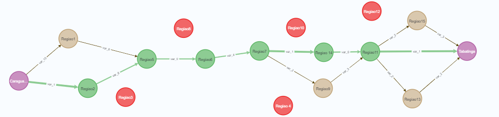
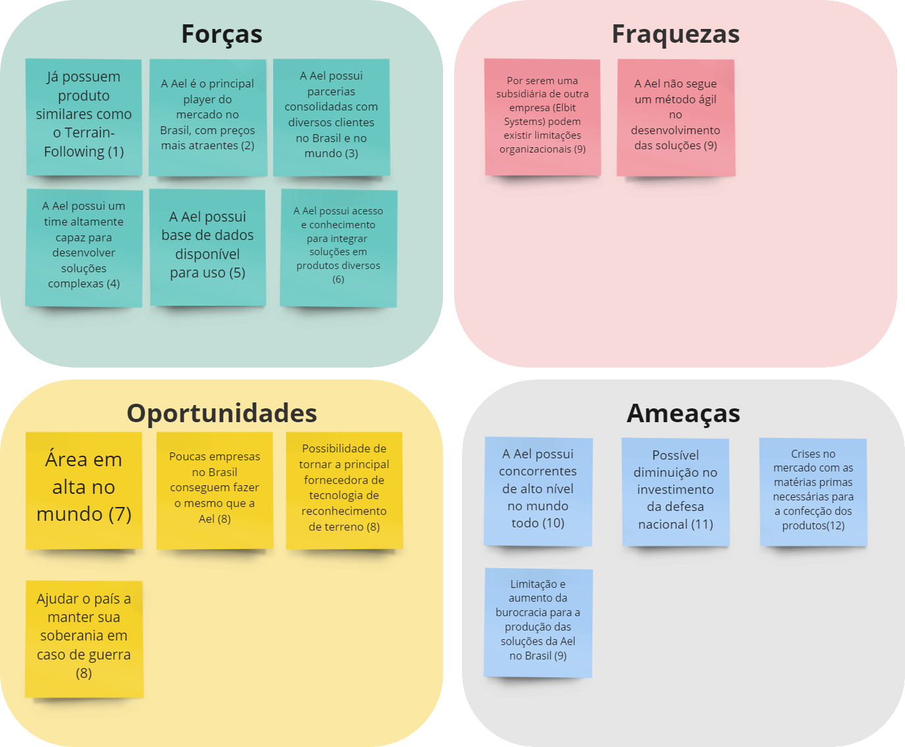

<table>
<tr>
<td>
<a href= "https://ael.com.br/"></a>
</td>
<td><a href= "https://www.inteli.edu.br/"></a>
</td>
</tr>
</table>

<font size="+12"><center>
Planejador de trajetórias para voos em baixa altitude
</center></font>

- [Autores](#autores)
- [Visão Geral do Projeto](#visão-geral-do-projeto)
  - [Empresa](#empresa)
  - [O Problema](#o-problema)
    - [Contexto do problema](#contexto-do-problema)
    - [Quais os dados disponíveis](#quais-os-dados-disponíveis)
    - [Qual o objetivo do problema](#qual-o-objetivo-do-problema)
    - [Qual a tomada de decisão do problema proposto](#qual-a-tomada-de-decisão-do-problema-proposto)
      - [Região de voo](#região-de-voo)
      - [Pontos de chegada e partida](#pontos-de-chegada-e-partida)
      - [Zonas de exclusão](#zonas-de-exclusão)
    - [Limitações existentes no problema](#limitações-existentes-no-problema)
  - [Representação do Problema em um Grafo usando Neo4j](#representação-do-problema-em-um-grafo-usando-neo4j)
  - [Descrição da solução](#descrição-da-solução)
    - [Problema](#problema)
    - [Qual a solução proposta](#qual-a-solução-proposta)
    - [Como a solução deverá ser utilizada](#como-a-solução-deverá-ser-utilizada)
    - [Benefícios trazidos pela solução](#benefícios-trazidos-pela-solução)
    - [Qual será o critério de sucesso e qual medida será utilizada para o avaliar](#qual-será-o-critério-de-sucesso-e-qual-medida-será-utilizada-para-o-avaliar)
  - [Objetivos](#objetivos)
    - [Objetivos gerais](#objetivos-gerais)
    - [Objetivos específicos](#objetivos-específicos)
  - [Partes interessadas](#partes-interessadas)
- [Análise do Problema](#análise-do-problema)
  - [Análise da área de atuação: Contexto da indústria](#análise-da-área-de-atuação-contexto-da-indústria)
    - [Principais competidores](#principais-competidores)
    - [Modelos de negócio](#modelos-de-negócio)
    - [Tendências de mercado](#tendências-de-mercado)
  - [Análise estratégica: 5 forças de Porter](#análise-estratégica-5-forças-de-porter)
  - [Análise do cenário: Matriz SWOT](#análise-do-cenário-matriz-swot)
  - [Proposta de Valor: Value Proposition Canvas](#proposta-de-valor-value-proposition-canvas)
  - [Matriz de Risco](#matriz-de-risco)
- [Requisitos do Sistema](#requisitos-do-sistema)
  - [Personas](#personas)
  - [Histórias dos usuários ("User Stories")](#histórias-dos-usuários-user-stories)
- [Arquitetura do Sistema](#arquitetura-do-sistema)
  - [Módulos do Sistema e Visão Geral (Big Picture)](#módulos-do-sistema-e-visão-geral-big-picture)
  - [Descrição dos Subsistemas](#descrição-dos-subsistemas)
    - [Requisitos de software](#requisitos-de-software)
  - [Tecnologias Utilizadas](#tecnologias-utilizadas)
- [UX e UI Design](#ux-e-ui-design)
  - [Wireframe + Storyboard](#wireframe--storyboard)
  - [Design de Interface - Guia de Estilos](#design-de-interface---guia-de-estilos)
- [Projeto de Banco de Dados](#projeto-de-banco-de-dados)
  - [Modelo Conceitual](#modelo-conceitual)
  - [Modelo Lógico](#modelo-lógico)
- [Teste de Software](#teste-de-software)
  - [Testes Unitários](#testes-unitários)
  - [Teste de Usabilidade](#teste-de-usabilidade)
- [Análise de Dados](#análise-de-dados)
- [Manuais](#manuais)
  - [Manual de Implantação](#manual-de-implantação)
  - [Manual do Usuário](#manual-do-usuário)
  - [Manual do Administrador](#manual-do-administrador)
- [Referências](#referências)


# Autores

* André Luís Lessa Junior
* Arthur Alberto Cardoso Reis
* Cristiane Andrade Coutinho
* Giovana Lisbôa Thomé
* João Pedro Sartori Garcia de Alcaraz
* Luiz Francisco Granville Gonçalves
* Stefano Tosi Butori


# Visão Geral do Projeto

## Empresa

*Descrição_da_empresa*

## O Problema

### Contexto do problema

Diversas operações militares destinadas principalmente à defesa e segurança pública requerem voos de baixa altitude por questões de logística e detecção de aeronaves. Atualmente, a AEL Sistemas S.A. atende clientes com potencial de uso de sistemas capazes de traçar trajetórias desses tipos de voos, que apresentam altos riscos ligados às suas operações. O termo CFIT, do inglês Controlled Flight Into Terrain, refere-se à acidentes de colisão com solo em voos controlados, uma das principais causas de acidentes aéreos envolvendo mortes. Em decorrência da proximidade com o solo, o risco de CFIT aumenta consideravelmente.

### Quais os dados disponíveis

Inicialmente, a empresa parceira passou dados de duas regiões para testagem e desenvolvimento do sistema. São duas pastas com informações geográficas dos estados do Rio de Janeiro e São Paulo contidas em arquivos de extensão `.dt2`. Em seu carregamento, utilizando a biblioteca GDAL em Java, são visualizadas regiões com variações de cores dependendo de suas respectivas altitudes e coordenadas geográficas.

Esses dados, juntamente a outros, serão inputados pelo usuário no momento de utilização do sistema. Os seguintes inputs são planejados no escopo do projeto:

- Região de voo - como já mencionado, o sistema será alimentado com dados geográficos indicando a região que o voo acontecerá, incluindo latitude, longitude e altitude, nos arquivos `.dt2`;
- Pontos de partida e chegada - serão vértices do grafo, representados por coordenadas geográficas, onde a notação *x, y, z* correspondem à latitude, longitude e altitude dentro da região de voo;
- Zona de exclusão - caracterizadas por localizações dentro da região de voo em que a aeronave não poderá passar, ou seja, será uma zona excluída pelo sistema ao planejar a rota de voo. Sua área pode ser representada por polígonos fechados, área de uma circunferência dado um raio *r* a partir de uma coordenada no mapa, etc;
- Vértices de rota obrigatórias - se é de desejo do(s) usuário(s), existirá a opção de seleção de vértices no mapa (nós do grafo) que serão obrigatórias no planejamento de rota de voo;

### Qual o objetivo do problema

A resolução do problema consiste em trazer um planejador de trajetórias para voos de baixa altitude utilizando grafos, a partir do mapeamento do terreno com base nos dados de relevo disponibilizados.

### Qual a tomada de decisão do problema proposto

Para desenvolvimento do projeto, é fundamental que todas as variáveis relacionadas ao problema, estejam tangiveis à solução. Por isso, o grupo considera algumas variáveis para o desenvolvimento da solução que devem ser levado em consideração:  Região de voo, Pontos de chegada e partida, Zonas de exclusão.

#### Região de voo

Região que o voo será operado, incluindo variáveis de latitude, longitude e altitude da região.

#### Pontos de chegada e partida

As vértices no grafo são representadas por coordenadas geográficas, onde a notação *x, y, z*
 correspondem à latitude, longitude e altitude dentro da região de voo. Dessa forma, é considerado que para saber quais pontos (vertices ou nós) a rota obrigatoriamente deverá passar, é preciso que a rota percorra determinadas arestas (percurso do nó).

#### Zonas de exclusão

Caracteriza localizações dentro da região de voo em que a aeronave não poderá operar, por exemplo terrenos que existam impedimentos maior que a altitude que o voo estará operando. Sua área pode ser representada por polígonos fechados, área de uma circunferência dado um raio *r*.
 a partir de uma coordenada no mapa, etc;

### Limitações existentes no problema

A complexidade de desenvolver a solução para este problema é alta, para o desenvolvimento dos algoritmos é necessário o alto uso de memória, sendo que o uso da memória irá aumentar de acordo com a escala dos grafos fazendo com que haja demora na execução do algoritmo e não seja um produto altamente escalável.

Outro fator importante é a experiência dos desenvolvedores para a criação da solução, devido a complexidade do problema, a acurácia do algoritmo pode ser um obstáculo considerando sua eficiência e implementação, sendo necessário pensar na estruturação dos dados e sua compatibilidade.

Por fim, há fatores externos que são limitações para este problema, como a complexidade dos terrenos e a detecção de obstáculos para que não haja nenhuma colisão, também as condições climáticas podem atrapalhar o percurso criado pelos grafos.

## Representação do Problema em um Grafo usando Neo4j

Para representar o problema descrito previamente de uma forma matemática e computacionalmente eficiente, foi necessário a utilização de grafos. A representação do problema em um grafo pode ser realizada usando o banco de dados neo4j, com um código a título de exemplo abaixo:

```cypher
Create(v0:Caraguatatuba{nome:"Caraguatatuba",coord:"22°54'.62''S 45°24'32.26''O ",elev_m:2}) 
Create(v1:Region1{nome:"Regiao1",coord:"23°36'27.96''S 45°23'30.90''O",elev_m:17})
Create(v2:Region2{nome:"Regiao2",coord:"23°37'.34.30''S 45°22'56.23''O",elev_m:3})
Create(v3:Region3{nome:"Regiao3",coord:"23°35.26.82''S 45°22' 58.97''O",elev_m:150})
Create(v4:Region4{nome:"Regiao 4",coord:"23°34'56.72''S 45°21'53.91''O",elev_m:80})
Create(v5:Regiao5{nome:"Regiao5",coord:"23°36'31.10''S 45°22'29.60''O",elev_m:11})
Create(v6:Region6{nome:"Regiao6",coord:"23°36'31.10''S 45°21'35.96''O",elev_m:11})
Create(v7:Region7{nome:"Regiao7",coord:"23°35'45.52''S 45°20'34.25''O",elev_m:7})
Create(v8:Region8{nome:"Regiao8",coord:"23°31'19.12''S 45°21'22.89''O",elev_m:116})
Create(v9:Region9{nome:"Regiao9",coord:"23°34'51.37''S 45°22'29.60''O",elev_m:5})
Create(v10:Region10{nome:"Regiao10",coord:"23°34'06.74''S 45°20'16.31''O",elev_m:60})
Create(v11:Region11{nome:"Regiao11",coord:"23°34'34.34''S 45°19'00.34''O",elev_m:8})
Create(v12:Region12{nome:"Regiao12",coord:"23°33'50.54''S 45°19'11.68''O",elev_m:130}    )
Create(v13:Region13{nome:"Regiao13",coord:"23°34'23.24''S 45°17'21.07''O",elev_m:9})
Create(v14:Region14{nome:"Regiao 14",coord:"23°34'49.20''S 45°19'56.28''O",elev_m:8})
Create(v15:Regiao15{nome:"Regiao15",coord:"23°34'12.47''S 45°17'21.10''O",elev_m:10})
Create(v16:Arrival_Place{nome:"Tabatinga",coord:"23°34'33.96''S 45°16'30.92''O",elev_m:7})
Create(v0)-[r1:var_15]->(v1)
Create(v0)-[r2:var_1]->(v2)
Create(v1)-[r3:var_6]->(v5)
Create(v2)-[r4:var_8]->(v5)
Create(v5)-[r5:var_0]->(v6)
Create(v6)-[r6:var_4]->(v7)
Create(v7)-[r7:var_2]->(v9)
Create(v7)-[r8:var_1]->(v14)
Create(v9)-[r9:var_3]->(v11)
Create(v14)-[r10:var_0]->(v11)
Create(v11)-[r11:var_1]->(v16)
Create(v11)-[r12:var_2]->(v13)
Create(v11)-[r13:var_2]->(v15) 
Create(v13)-[r14:var_2]->(v16)
Create(v15)-[r15:var_3]->(v16) 
Return v0,v1,v2,v3,v4,v5,v6,v7,v8,v9,v10,v11,v12,v13,v14,v15,v16
```

O código acima irá gerar um grafo, que pode ser representado visualmente da seguinte forma:



Nesse caso, o ponto de partida seria Caraguatatuba e o de destino Tabatinga. Existem rotas impossíveis, que não tem arestas, como entre a Região 5 e Região 8. Também há rotas possíveis, porém não otimizadas, como entre a região 7 e região 9. A solução proposta utiliza um algoritmo que encontra a rota mais eficiente entre o ponto de destino e origem, que passa pelas regiões 2, 5, 6, 7, 14 e 11.

## Descrição da solução

### Problema
Voos de baixa altitude consiste em voar com uma proa constante, em uma altitude constante, um pouco acima da maior elevação do terreno trecho da rota. Aeronaves que realizam esse tipo de navegação, contemplam tanto incursões em territórios contestado quanto missões de busca e salvamento. Esse tipo de operação dificilmente é realizada por pilotos inexperientes, que por causa da proximidade com o solo, a missão pode representar um risco iminente de colisão. Tendo em vista o problema da baixa altitude representar um grande risco a aeronave e tripulantes, a empresa AEL juntamente com o Inteli propõem que seja implementado um Planejador de trajetórias para voos em baixa altitude.

### Qual a solução proposta

A solução proposta é um software que permite computar uma rota otimizada para um vôo em baixa altitude de uma aeronave, com base em parâmetros predefinidos. O software recebe como entrada um arquivo `.dt2` contendo informações geográficas de uma região, e retorna uma rota ótima para um vôo entre dois pontos, tendo em mente as restrições especificadas pelo usuário. A solução é baseada em grafos, e utiliza algoritmos eficientes para encontrar a rota ótima.

### Como a solução deverá ser utilizada

O software desenvolvido será usado para gerar uma trajetória de voo ótima a partir de um ponto de partida e um ponto de destino, levando em consideração as restrições especificadas. A solução deverá ser utilizada como um auxílio para os pilotos realizarem voos em baixa altitude. Idealmente, a rota gerada será analisada e estudada pelo piloto e sua equipe durante o planejamento do voo, para garantir confiabilidade da rota. A solução, também, poderá servir como base para futuros projetos da empresa, especialmente o sistema de Terrain Following da AEL.

### Benefícios trazidos pela solução

A solução traz benefícios primordiais para o usuário do software. Podemos citar, principalmente, pontos positivos econômicos da tecnologia, visto que o avião pode percorrer sempre rotas que são mais curtas e que chegam com eficiência ao destino final, economizando principalmente o combustível durante as viagens. Outro ponto econômico importante que vale ressaltar é o tempo. Visto que melhores rotas são geralmente mais curtas e consequentemente gastam um tempo menor.

Esse aspecto é muito importante quando se trata de operações militares. Quanto mais se tem economia de tempo, maior a probabilidade de salvar vítimas em lugares de difícil acesso e portanto muito complexo de algum tipo de socorro chegar à tempo. Outra a situação que a economia de tempo em operações militares pode ser muito efetiva é em ataques à inimigos. Quanto maior for a economia de tempo no deslocamento dos aviões, maior a chance de interceptá-los durante a missão.

Outro benefício que podemos citar, nesse caso, envolve as características físicas do piloto. Assim sendo, podemos abordar a redução do cansaço desse piloto durante as viagens, visto que as melhores rotas também são caminhos menos complexos e que exigem menos da atenção da pessoa comparado aos outros tipos de rotas, além de contribuir com a produtividade e a disposição do mesmo. Os caminhos de difíceis acesso podem reduzir riscos de acidentes e mortes dos piloto prezando pela sua integridade física.

### Qual será o critério de sucesso e qual medida será utilizada para o avaliar

Ao gerar uma trajetória dentro da área, foram definidos alguns critérios para avalia-la. É necessário que a trajetória ligue o ponto de partida ao ponto de chegada sem sair de dentro da área especificada e evitando as áreas restritas, alem de que deve ser viável para o modelo do avião especificado, ou seja, o percurso não pode conter curvas que não sejam possíveis de realizar com esse tipo de veículo. Como a solução tem como foco específico voos de baixa altitude, é muito importante que não haja uma elevação significante durante todo o trajeto, logo o avião irá contornar as zonas de alta altitude.

Um caminho que cumpra todos esses aspectos, de forma otimizada, pode ser considerado como sucesso. Mas, para validar este critério será necessário que o trajeto seja analisado pela AEL, para que possa ser classificado, de fato, como um caminho viável e otimizado.

## Objetivos

### Objetivos gerais

*Lista_de_objetivos_gerais*

### Objetivos específicos

*Lista_de_objetivos específicos*

## Partes interessadas

*Lista_e_apresentação_das_partes_interessadas*

# Análise do Problema

## Análise da área de atuação: Contexto da indústria

A AEL Sistemas está inserida nas indústrias aeroespacial, de defesa e de segurança pública, sendo sua atuação focada no território brasileiro. A empresa tem como produto principal a produção de sistemas eletrônicos militares para aplicações em plataformas aéreas, mas também atua em outras áreas, como na produção de simuladores de voo e sistemas eletro-ópticos, espaciais e para veículos blindados.

### Principais competidores

Tendo em mente que a AEL Sistemas é uma empresa de médio porte que atua principalmente no mercado brasileiro aeroespacial, seus principais competidores são empresas de médio e grande porte nacionais, como:

- Embraer S.A. -  empresa de capital aberto com sede em São José dos Campos, São Paulo, Brasil. É uma das maiores empresas brasileiras de engenharia e fabricação de aeronaves, com atuação em diversos segmentos do mercado aeroespacial, como aeronaves comerciais, executivas, militares, de defesa e de transporte de cargas.

- Atech - empresa integrante do grupo econômico da Embraer, com foco em sistemas críticos civis e militares, como, por exemplo, sistemas de Controle de Tráfego Aéreo.

- Helibras (Helicópteros do Brasil S.A.) - empresa brasileira consolidada em Itajubá, Minas Gerais, sendo uma subsidiária da Airbus Helicopters. A empresa primariamente no ramo de fabricação de helicópteros civis e militares.

- Avibras Indústria Aeroespacial - empresa sediada em São José dos Campos, São Paulo, Brasil, que atua no ramo de defesa, com foco em sistemas de mísseis, foguetes e sistemas antiaéreos e com atuação no setor aeroespacial.

- Akaer - empresa brasileira de engenharia aeroespacial, com sede em São José dos Campos, São Paulo, Brasil. Desenvolveu projetos militares para aeronaves como o caça SAAB Gripen e helicópteros da Helibras.

### Modelos de negócio

Companhias do setor aeroespacial e de defesa possuem modelos de negócio diversos, que envolvem produtos e serviços complexos e altamente tecnológicos. As atividades envolvidas abrangem desde a produção de aeronaves, como no caso da Embraer (fabricante de aeronaves comerciais, executivas e militares), até o desenvolvimento de sistemas eletrônicos para aeronaves (aviônicos), como ocorre com a AEL Sistemas, que produz sistemas eletrônicos militares com aplicações em plataformas aéreas e outras áreas.

Existe um grande foco na área de defesa em contratos governamentais, pois os clientes das companhias são as forças armadas de diferentes países. Além disso, as companhias do setor aeroespacial e de defesa possuem um grande foco em pesquisa e desenvolvimento, por se tratar de um mercado competitivo em que a inovação tecnológica é um importante diferencial. Existe também uma tendência de diversificação, com o foco em uma área principal e oferta de produtos e serviços complementares, relacionado com as competências e capacidades do corpo técnico da companhia.

### Tendências de mercado

As tendências do mercado de aviação militar no Brasil incluem:

- a modernização de alguns aviões da frota da Força Aérea Brasileira (FAB), como os “aviões-radares” E-99;
- a aquisição de novos aviões militares para melhorar a capacidade de defesa aérea e de operações aéreas, como o caça sueco F-39 Gripen E/F, com a adoção de tecnologias e aviônicos como o Wide Area Display (WAD) desenvolvido pela AEL Sistemas;
- a expansão da cooperação internacional e a parceria com empresas estrangeiras, como no caso da Embraer e da BAE Systems PLC (uma empresa britânica), que firmaram dois memorandos de entendimento ("MoU"s) para possibilitar a venda de aeronaves militares produzidas pela Embraer como o C-390 Millennium, um avião militar de transporte de cargas, em mercados onde a BAE Systems possui maior presença (especialmente no Oriente Médio).

## Análise estratégica: 5 forças de Porter

Considerando a AEL Sistemas como uma empresa que atua no mercado brasileiro aeroespacial, foi utilizada a ferramenta de análise estratégica das 5 forças de Porter, que permite identificar os principais fatores que influenciam a estratégia competitiva de uma empresa.


1. Rivalidade entre os concorrentes existentes: a indústria aeroespacial militar brasileira é um mercado relativamente concentrado. Existem alguns players dominantes, especialmente a Embraer S.A., que possuem uma grande participação no mercado.

2. Poder de barganha dos fornecedores: a cadeia de suprimentos da indústria é complexa, incluindo materiais especializados e tecnologia avançada. Isso pode dar aos fornecedores um poder de barganha elevado, pois não existem tantos players capacitados para fornecer os insumos necessários.

3. Poder de barganha dos compradores: os compradores são principalmente governos e agências militares, que têm um poder de barganha considerável devido ao seu grande porte e capacidade elevada de investimento.

4. Ameaça de novos concorrentes: a barreira de entrada na indústria aeroespacial é altamente elevada devido aos custos significativos de desenvolvimento e produção. Além disso, se trata de uma indústria muito regulamentada, o que pode limitar a entrada de novos players.

5. Ameaça de produtos substitutos: não existem alternativas viáveis para os sistemas militares avançados desenvolvidos pelas empresas do setor, o que limita a ameaça de produtos substitutos.

## Análise do cenário: Matriz SWOT



## Proposta de Valor: Value Proposition Canvas


## Matriz de Risco

A matriz de risco foi elaborada considerando fatores categorizados em externos, internos e software. A categoria externa engloba condições climáticas e oportunidades de mercados, além de dependência para o desenvolvimento da solução como a quantidade de dados. Já a categoria interna contém problemas e oportunidades como problemas nos processos de criação que envolvem o nível de experiência da equipe. Por último a categoria de software, na qual inclui complexidade do algoritmo e outros fatores.


# Requisitos do Sistema

## Personas

Para a elaborar uma solução centrada ao usuário, foram criadas 2 personas que serão os alvos para o desenvolvimento da solução representando tanto o piloto quanto a equipe que opera o sistema juntamente com o piloto, sendo eles: Fabiano Gousmann - Especialista em Informações Aeronáuticas responsável pelo planejamento da vôos militares da Força Aérea Brasileira ("FAB") e Rodrigo Mendes - piloto da FAB.

*Persona 1*


*Persona 2*


## Histórias dos usuários ("User Stories")

| Épico | User Story |
| --- | --- |
| Otimização de rota  | Eu, como planejador, quero fornecer um arquivo contendo informações sobre uma região de voo (com dados de longitude, latitude e longitude) e encontrar a melhor rota de voo militar em baixa altitude entre um ponto inicial e final, para que possa garantir o sucesso da missão |
|  | Eu, como piloto, quero seguir a rota de voo fornecida pelo planejador, para reduzir minha carga cognitiva e facilitar a conclusão da minha missão |
| Parâmetros pré-definidos | Eu, como planejador, quero fornecer alguns parâmetros predeterminados (altitude máxima aceitável, raio mínimo de curva entre dois pontos, diferença de altitude entre dois pontos, consumo de combustível) para que possa restringir as rotas possíveis |
| Restrição de altitude | Eu, como planejador, quero calcular uma rota que não exceda uma altitude predeterminada do solo, para previnir possíveis riscos operacionais e dar maior segurança ao piloto |
|  | Eu, como piloto, quero que o planejador forneça uma rota segura para um voo em baixa altitude, para que exista o máximo de segurança em uma operação |
| Eficiência na escolha da rota | Eu, como planejador, quero encontrar uma rota usando um sistema com eficiência computacional aceitável e que forneça uma solução dentro de um tempo razoável, para evitar atrasos operacionais |
| Gasto de combustível | Eu, como planejador, quero evitar o gasto excessivo de combustível, para garantir que não haja interrupções no voo devido a falta de recursos (pane seca) |
| Restrições de Rota e Zonas de Exclusão | Eu, como planejador, quero ser capaz de inserir informações sobre a presença de obstáculos ou ameaças aéreas em uma determinada área, para que o piloto possa evitá-los e garantir a segurança do voo |
| Armazenamento e compartilhamento de Rota | Eu, como planejador, gostaria de salvar e compartilhar minhas rotas de voo com outros membros da equipe para que possamos colaborar e melhorar a segurança da missão |

# Arquitetura do Sistema

## Módulos do Sistema e Visão Geral (Big Picture)

## Descrição dos Subsistemas

### Requisitos de software

## Tecnologias Utilizadas


# UX e UI Design

## Wireframe + Storyboard

## Design de Interface - Guia de Estilos


# Projeto de Banco de Dados

## Modelo Conceitual

## Modelo Lógico


# Teste de Software

## Testes Unitários

## Teste de Usabilidade


# Análise de Dados


# Manuais

## Manual de Implantação

## Manual do Usuário

## Manual do Administrador


# Referências
